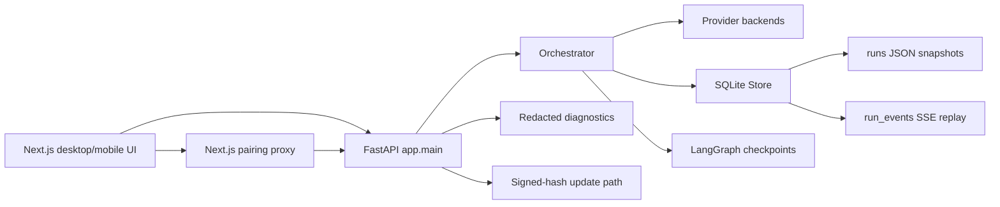
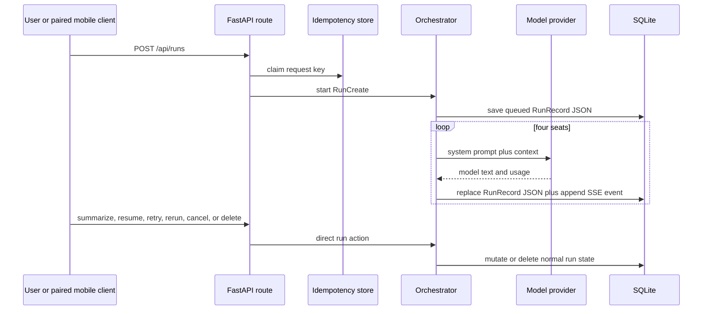

# High-Risk Decision Support Architecture Audit

Date: 2026-07-30
Baseline: `main@567ce2016ef843f005388e4c9de37d5253ad97b8` (`v0.8.4`)
Scope: read-only audit of backend, frontend, storage, recovery, SSE, mobile access,
diagnostics, evaluation, CI, and release paths.

## Executive finding

Council Lab has a reliable local deliberation workflow, but it is not currently a
high-risk decision support system. `QuestionAnalysis.high_risk_domain` is a keyword
warning, not a policy boundary. There is no persisted risk assessment, required-fact
gate, high-risk state machine, reviewer authorization, approval binding, or immutable
security audit log. Existing run actions can therefore not be made safe by adding UI
buttons or prompts alone.

P0 should add a separate server-side control plane while leaving normal Council runs
unchanged. High-risk state, approvals, and audit events require normalized tables and
transactional repository methods. Existing `RunRecord` JSON remains the deliberation
snapshot, not the security authority.

## Current architecture



`backend/app/main.py` constructs `Store`, provider registry, `Orchestrator`, and
assignments at import time and owns all HTTP routes. `backend/app/orchestrator.py`
owns classification, workflow, provider calls, run mutation, recovery, retry,
cancellation, and deletion. `backend/app/store.py` serializes full `RunRecord` objects
to `runs.payload`, while `run_events` is a replayable UI event stream.

## Current data flow



No server-side step currently asks whether the run is high-risk before an action
route mutates it. Recovery derives authority from `RunRecord.status` and checkpoint
presence. An idempotency record prevents duplicate HTTP work but does not represent
approval or authorization.

## Trust boundaries

1. User and uploaded content to API: untrusted. Legacy file/web ingestion is disabled
   by default but remains in the distribution and can be re-enabled by environment.
2. Paired mobile browser to Next.js proxy: authenticated by a signed in-memory pairing
   session, but a paired device is not a high-risk reviewer identity.
3. API to model provider: external boundary for non-local providers. Questions,
   context, and discussion content may leave the device by explicit provider choice.
4. Model output to workflow: untrusted advisory text. It must not set risk tier,
   transition status, approve actions, or classify tool effects.
5. FastAPI to SQLite/checkpoint files: local persistence boundary. Security state and
   its audit record must commit atomically.
6. Diagnostics and update paths: diagnostics correctly omit content and credentials;
   update installation uses a local-app header but is outside high-risk action approval.

## STRIDE threat model

| Threat | Concrete path | Current control | P0 requirement |
|---|---|---|---|
| Spoofing | Paired user claims reviewer identity in a JSON body | No reviewer identity exists | Server-configured reviewer credentials and actor binding |
| Tampering | Action/report changes after approval | No approval object | Canonical SHA-256 binding and invalidation |
| Repudiation | Approve/reject/override is denied later | SSE events are deletable with a run | Append-only audit table outside normal deletion |
| Information disclosure | Sensitive facts enter logs/diagnostics | Diagnostics omit bodies; errors may include provider text | Audit metadata allowlist and hashed summaries only |
| Denial of service | Repeated transitions or approvals create work | Normal run limits and idempotency | No model calls in P0 control plane; bounded payloads |
| Elevation of privilege | Old summarize/resume/rerun route skips review | No high-risk gate | Central route guard plus transactional state machine |

## High-risk entry points and bypass paths

- `POST /api/runs`: accepts arbitrary `mode`; no dedicated high-risk request contract.
- `POST /api/runs/{id}/advance`, `/interject`, `/retry-turn`, `/resume`,
  `/summarize`, `/rerun`, `/cancel`: call the normal orchestrator directly.
- `PUT /api/runs/{id}/decision-review`: records an outcome review, not an approval,
  and has no reviewer authorization.
- `DELETE /api/runs/{id}`: deletes run, SSE events, and checkpoints. Security audit
  records must not be cascaded through this path.
- `recover_incomplete_runs()`: resumes normal states from JSON/checkpoints and cannot
  recover or enforce high-risk gates.
- `execute_idempotent_run_action()`: caches a `RunRecord`; replay is request-scoped,
  not action- or report-bound authorization.
- Direct `Store.save_run()`: replaces a snapshot without optimistic versioning or a
  policy transaction.
- Mobile forwarding: pairing grants the same run APIs; UI omission cannot prevent a
  crafted request.
- Model output: prompts currently warn about evidence limits, but output is free text
  and cannot create verified facts or safe approvals.

## Data model gaps

The repository cannot currently persist these required authorities:

- risk tier, domains, classifier version, original assessment, and human override;
- required facts, materiality, source, verification state, and missing-fact gate;
- high-risk status with explicit transition version;
- structured decision status and quality signals;
- action draft and decision report hashes;
- reviewer identity, authorization, separation of duties, expiry, revocation;
- append-only policy audit events committed with state changes.

`RunRecord.status` must remain the normal workflow status. Extending it with uppercase
high-risk states would couple checkpoint recovery and SSE UI logic to security policy.

## Existing safeguards worth preserving

- Persistent request idempotency with request fingerprints.
- LangGraph checkpoint detection and conservative restart recovery.
- Provider credentials outside SQLite payloads and public serialization redaction.
- Diagnostic bundles exclude prompts, responses, sources, credentials, cookies,
  pairing tokens, hostnames, and paths.
- HTML exports escape model and user text.
- Trusted host and narrow localhost CORS middleware.
- Mobile pairing uses HMAC, same-origin validation, rate limiting, expiry, and revocation.
- Legacy Workspace writes are disabled by default.
- CI runs backend coverage, frontend type checks/unit tests, dependency audit, and E2E.

## Findings

### P0

1. No authoritative high-risk state machine or fail-closed transition service.
2. Missing critical facts cannot block summarization or completion.
3. No persisted, authorized, expiring, non-replayable human approval protocol.
4. Existing action, retry, recovery, rerun, and deletion paths can bypass any UI-only gate.
5. No atomic append-only audit record for safety-sensitive state changes.
6. No server-side representation that all external side effects are prohibited in P0.

### P1

1. Evidence snapshots are content blobs, not source/claim relationships; citation
   existence, support, jurisdiction, and freshness are not enforceable.
2. Risk classification is a small keyword list and omits compliance and production
   incidents; negation and mixed-language cases are fragile.
3. `main.py` and `orchestrator.py` concentrate policy-sensitive responsibilities.
4. Application dependencies are global mutable objects created at import time.
5. Mobile sessions are in-memory and identify a device class, not a human actor.

### P2

1. Synchronous SQLite calls execute inside async methods.
2. Full run JSON is rewritten after each turn.
3. CI actions use moving major tags and workflow ownership is not protected by
   `CODEOWNERS`; this is a supply-chain hardening gap, not a P0 blocker.
4. No published real-model high-risk safety benchmark exists.

### P3

1. Platform code signing/notarization is incomplete.
2. Legacy file/web ingestion remains packaged despite retirement from the main path.

## Recommended P0 structure

```text
backend/app/risk/
  schemas.py          # Pydantic contracts and canonical hashing
  classifier.py       # deterministic server-side baseline classification
  policy.py           # required-fact and external-effect rules
  state_machine.py    # explicit transition table
  service.py          # authorization and transactional use cases
backend/app/audit/
  redaction.py        # metadata allowlist and bounded hashes
```

Do not split normal routes or orchestrator in this change. P0 should import one
`HighRiskService` from `main.py`; broad application-factory refactoring remains P1.

## Recommended API

- `POST /api/high-risk/runs`: create draft, assess risk, persist initial audit chain.
- `GET /api/high-risk/runs/{run_id}`: return public control state and active approval.
- `PUT /api/high-risk/runs/{run_id}/facts`: replace bounded required facts and re-evaluate.
- `POST /api/high-risk/runs/{run_id}/transition`: request an allowed policy transition.
- `POST /api/high-risk/runs/{run_id}/approval-requests`: bind action and report hashes.
- `POST /api/high-risk/runs/{run_id}/approvals/{approval_id}/decision`: approve/reject.
- `POST /api/high-risk/runs/{run_id}/approvals/{approval_id}/revoke`: revoke approval.
- `POST /api/high-risk/runs/{run_id}/risk-override`: authorized tier override.
- `GET /api/high-risk/runs/{run_id}/audit`: read redacted audit history.

High-risk routes require explicit actor headers in local P0. Reviewer authorization is
backed by server configuration, not by client-provided role. P0 never executes actions.

## Recommended database tables

- `high_risk_runs`: one row per linked run; current status, version, assessment JSON,
  facts JSON, decision JSON, report/action hashes, timestamps.
- `high_risk_approvals`: immutable identity and binding fields plus mutable terminal
  status timestamps; unique active approval binding.
- `high_risk_audit_events`: append-only sequence, actor metadata, transition fields,
  hashes, and redacted metadata JSON.
- `high_risk_reviewers`: not required in P0; authorization can use a configured
  reviewer ID allowlist. A database reviewer directory would imply user management.

SQLite triggers should reject UPDATE/DELETE of audit events. Repository methods should
use `BEGIN IMMEDIATE`, optimistic `version`, and state-plus-audit atomic commits.

## Test matrix

| Area | Positive | Negative/adversarial | Recovery/concurrency |
|---|---|---|---|
| Classification | all five domains, tier monotonicity | obfuscated attempts, model cannot lower | persisted assessment after reopen |
| State machine | every allowed edge | every illegal edge, old route bypass | optimistic race loses safely |
| Facts | complete critical facts advance | missing critical fact blocks | restart preserves gate |
| Approval | distinct authorized reviewer approves | self-approval, unauthorized, hash mismatch, cross-run replay | expiry, revoke, concurrent decisions |
| Audit | state and event commit together | update/delete trigger, sensitive metadata rejection | audit failure rolls back state |
| Idempotency | same request replays | changed body conflicts | pending operation survives restart |
| Privacy | redacted response/export | secrets and full records rejected | diagnostic snapshot contains counts only |
| Compatibility | standard create/run/export unchanged | standard run rejected by high-risk API | existing v4 database migrates and restores |

## Unknowns

- Council Lab has no user accounts or organizational identity provider. P0 can provide
  local configured actor IDs and reviewer allowlists, but cannot prove real-world
  professional credentials.
- The repository has no authoritative medical, legal, financial, compliance, or
  incident policy corpus. Domain-specific completeness remains P3.
- No real-model high-risk benchmark exists; no safety-effect claim is justified.
- A professional security assessment and domain-expert validation remain external work.

## Rejected approaches

- Prompt-only safety: model output cannot enforce state, identity, or atomicity.
- Reusing `RunRecord.status`: creates recovery and old-route bypass ambiguity.
- Reusing SSE `run_events`: normal deletion removes them and they are not immutable.
- Approval tokens returned to clients: increases replay and leakage risk; approval is a
  server-side record checked by ID and hashes.
- Allowing action execution in P0: there is no tool sandbox, authorization system, or
  compensation model. P0 stores action drafts and remains side-effect free.
- Treating a paired mobile session as reviewer authorization: device pairing is not
  identity, role, or separation of duties.

## Audit conclusion

Proceed with a separate persisted P0 control plane. Keep all external actions blocked,
fail closed when facts, authorization, audit writes, or hashes are missing, and preserve
normal mode compatibility. No claim of medical, legal, financial, regulatory, or
security compliance is supported by this audit.
