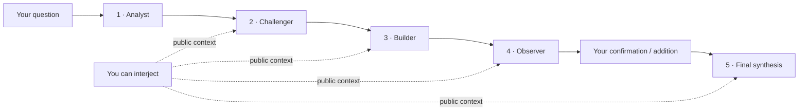

# Council Lab

Council is a local-first, human-participatory AI deliberation workspace. Four seats speak in sequence, respond to earlier arguments, and expose the discussion as it happens. After seat four, Council waits for your confirmation or additions before a fifth model call produces the final answer.

[中文说明](README.md) · [Download](https://github.com/loveramarois-byte/council-lab/releases/latest) · [Install guide](docs/INSTALL.md) · [Contributing](CONTRIBUTING.md)


## Why Council

- **A discussion, not four disconnected answers.** Each later seat must agree, partially agree, or challenge what came before.
- **You remain in the room.** Interjections become public context for later seats and the final synthesis.
- **Independent seat configuration.** Choose a provider and model for each of the four speakers and the finalizer; the configuration is snapshotted per run.
- **A deliberate confirmation point.** Council does not finalize after seat four until you approve or add more context.
- **High-risk decision gates.** Medical, legal, investment, compliance, and production-incident runs require time-bounded evidence, independent verification, domain-matched professional review, a separate final approver, and append-only audit records.
- **Traditional-culture joint analysis.** Version-pinned local engines freeze a reproducible calendar/chart snapshot before four specialist seats independently check the calculation, interpret traditions, compare schools, and challenge unfalsifiable claims.
- **Explicit first-run setup.** Council distinguishes the local scripted demo from real AI, then guides users through connecting a Provider and assigning all five seats.
- **Decision follow-up.** Record the decision taken, expected result, review date, actual outcome, and which seat hypotheses held up.
- **Recoverable runs.** SQLite persistence and LangGraph checkpoints preserve progress across restarts and enforced run limits.
- **Recoverable upgrades.** Explicit SQLite schema versions trigger a consistent pre-migration backup; a failed migration restores the original database.
- **Duplicate-cost protection.** Costly run mutations use persisted idempotency keys, so a network retry cannot silently start the same model work twice.
- **Replayable live events.** Persisted, sequenced SSE events resume after disconnects, refreshes, or phone backgrounding without repeating model calls; multiple tabs receive independent streams.
- **Portable reports.** Export a completed deliberation as Markdown or a self-contained HTML report.
- **Local-first credentials.** API keys are stored in the operating-system credential store, not Council's database or browser storage.
- **Verified in-app updates.** Council checks official releases, verifies the downloaded package against `SHA256SUMS.txt`, replaces the installed copy, and restarts without moving local data or credentials.
- **Redacted diagnostics.** A user-triggered support bundle reports runtime, storage integrity, and provider readiness without exporting conversations, log contents, credentials, model names, or host paths.
- **Paired mobile access.** Keep Council running on the computer, scan the code under **Settings -> Mobile Access**, and use a short-lived signed session that can be inspected and revoked from the desktop.
- **Reproducible evaluation.** A 12-case benchmark compares direct, extended-direct, self-refine, same-model Council, and cross-model Council runs with repeated, shuffled trials and execution confidence intervals. Mock or incomplete blind reviews cannot support quality claims.

Council never displays or saves hidden chain-of-thought. It stores only public model responses and run metadata. It does not currently run web searches or a code sandbox, and model agreement is **not** external fact verification.

## Traditional-culture mode

This optional mode calculates a local snapshot with `lunar-javascript@1.7.7` and `iztro@2.5.8`, then freezes engine provenance and a SHA-256 digest with the Run. Birth data is processed in the browser first; chart fields and required birth parameters enter configured model context only after explicit consent, while the optional birthplace remains local and is never sent to model seats. The current scope uses solar dates, `Asia/Shanghai` civil time, no true-solar-time adjustment, and no name field.

The mode studies traditional rules and interpretations; it does not establish scientific validity. It cannot be combined with high-risk controls, automatic finalization, prior decision memory, or specialized decision contracts. Traditional interpretations do not become DecisionBrief records, verified claims, decision follow-ups, or long-term memory. Medical, legal, investment, compliance, and production-action intent is rejected server-side. See [the mode boundary](docs/TRADITIONAL_CULTURE_MODE.md) and [third-party notices](NOTICE).

## High-risk mode

Enable **High-risk decision support** when creating the Run. The server persists the control record before any model task starts. Each critical fact must be bound to source provenance, timestamp, expiry, and an independently verified evidence record. A domain-matched professional must review the evidence snapshot and report before a different configured reviewer can grant final approval. Expired or conflicting evidence, medical red flags, role mismatch, or missing professional coverage fail closed.

Professional roles are reviewer attestations. Council validates reviewer secrets, domain-role policy, evidence snapshots, and report hashes; it does not verify licenses or execute prescriptions, trades, legal filings, compliance releases, or production changes.

P0 reviewers are configured by the desktop operator before startup, for example `COUNCIL_HIGH_RISK_REVIEWERS=reviewer-a:long-random-secret,reviewer-b:another-secret`. Use separate reviewer identities and long random secrets. A requester cannot approve their own request. Mobile pairing grants UI access only and never grants reviewer authority; reviewer credentials remain in the server environment and transient form state, not browser storage or SQLite.

This mode produces non-binding records only. It does **not** place trades, file legal documents, change medication, run production commands, or perform any other external side effect. It has no network evidence-verification layer, professional identity system, or regulatory certification, and does not replace qualified medical, legal, investment, compliance, or incident-response review.

## Download and run

### macOS

1. Download `Council-v*-macOS.zip` from the [latest release](https://github.com/loveramarois-byte/council-lab/releases/latest).
2. Unzip it and double-click **`Council.app`**.
3. Start with **Local Demo**, or open **Settings -> Model Providers** to connect a real API.

The release includes its own runtime. Python and Node.js are not required. This open-source build is ad-hoc signed but not Apple-notarized. If macOS blocks the first launch, Control-click `Council.app`, choose **Open**, and confirm.

### Windows 10 / 11

1. Download `Council-v*-Windows.zip` from the [latest release](https://github.com/loveramarois-byte/council-lab/releases/latest).
2. Right-click the ZIP, choose **Extract All**, and open the extracted folder.
3. Double-click **`Start Council.cmd`**.

The release includes its own runtime and needs neither administrator access nor a separate Python/Node.js installation. This open-source build is not commercially code-signed. If SmartScreen appears, verify that the file came from this repository's Release page, then choose **More info -> Run anyway**. `Create Desktop Shortcut.cmd` adds an optional shortcut.

Every release includes `SHA256SUMS.txt` and a GitHub build-provenance attestation. The checksum verifies downloaded content and the attestation links the build to a workflow and commit; neither replaces Apple notarization or Windows commercial code signing.

### Mobile access

1. Start Council on the computer and leave it running.
2. Open **Settings -> Mobile Access**.
3. Put the phone and computer on the same trusted Wi-Fi network, then scan the pairing code.
4. On iPhone, use Safari's **Add to Home Screen** action. On Android, use Chrome's **Add to Home screen** or **Install app** action when available.

The phone is a remote interface for the Council running on the computer. Model requests still originate from the computer, and API keys, CC Switch, and deliberation data are not moved to the phone. Separate desktop-bootstrap and mobile tokens prevent a phone token from gaining desktop session-management authority. A signed mobile session lasts at most 12 hours and never stores the raw pairing token in its cookie. The desktop reports active sessions and recent access, and can revoke all mobile sessions immediately. Restarting Council rotates both tokens and invalidates old pairings. Mobile access stops when the computer sleeps, shuts down, or exits Council.

A paired phone can use the ordinary Council UI, but its pairing session is not a high-risk reviewer identity. High-risk approval still requires a separately configured reviewer ID and secret.

LAN access uses plain HTTP and should only be enabled on a trusted private network, never on open public Wi-Fi. Pairing failures are rate-limited, and foreign origins, unknown hosts, non-JSON bodies, and oversized requests are rejected. Plain HTTP still cannot prevent passive monitoring on the same network. If the pairing address is unreachable, allow Council or Node.js to receive local-network connections on port `3000` in the operating-system firewall. See the [mobile access threat model](docs/THREAT_MODEL.md) for the full boundary.

### Updating an installed copy

Starting with `v0.4.0`, Council checks the official GitHub Release on launch. Open **Settings -> Software Update** to download, verify, replace, and restart the app. macOS may request system authorization when `Council.app` is in a protected folder. Windows updates the current extracted directory in place, so an existing desktop shortcut remains valid.

Versions `v0.3.0` and earlier do not contain the updater. Install `v0.4.0` manually once; later releases can be installed from inside Council.

## First connection

1. Run one question with **Local Demo**. It is offline, free, and verifies the full four-seat workflow.
2. Open **Settings -> Model Providers** and choose DeepSeek, Zhipu GLM, Kimi, SiliconFlow, OpenAI, CC Switch, or a compatible custom endpoint.
3. Follow **Get API Key**, paste the key, and select **Save and test**. Council stores the key, requests the provider's real model catalog, selects a model, and performs a minimal generation test.

If live model discovery fails, Council labels any built-in values as offline recommendations. They are troubleshooting hints, not claims about models enabled for your account. The live provider response remains authoritative.

## Deliberation flow



Each seat is a separate API call with its own public role prompt. Separate calls do not necessarily mean separate vendors: you may intentionally assign the same provider and model to multiple seats. Agreement between seats is still not proof that a claim is true.

Quick, Standard, and Rigorous are Council workflow and context tiers. Native reasoning effort is sent only by providers and protocols that explicitly support it.

The run page labels the current context count as either a matching tokenizer or a conservative estimate. Provider-reported cumulative usage remains a separate metric because upstream instructions and protocol framing are outside Council's public discussion window.

## Providers

| Provider | Setup | Model discovery |
| --- | --- | --- |
| CC Switch | Local route; credentials remain in CC Switch | Live route catalog or read-only recent successful model history |
| DeepSeek | API key | Live catalog with clearly labelled offline recommendations |
| Zhipu GLM | API key | Live catalog with clearly labelled offline recommendations |
| Kimi | API key | Live catalog with clearly labelled offline recommendations |
| SiliconFlow | API key | Live catalog |
| OpenAI | API key | Live catalog with clearly labelled offline recommendations |
| Custom compatible endpoint | URL and optional API key | Live catalog or manual model ID |
| Local Demo | No setup | Built-in Mock only |

Real providers receive your question, selected evidence, and public discussion context and may charge for requests. CC Switch continues to own upstream selection and failover; Council reports only the route state it can directly observe.

## Development

Source development requires Python 3.12+ and Node.js 22+:

```bash
git clone https://github.com/loveramarois-byte/council-lab.git
cd council-lab
./setup.sh
./start.sh
```

Council opens at <http://localhost:3000>. Linux is supported through the source workflow. See [docs/INSTALL.md](docs/INSTALL.md) for paths and troubleshooting.

## Privacy and status

Provider keys stay in macOS Keychain, Windows Credential Manager, or Linux Secret Service. Browsers use the same-origin Next.js proxy only; every FastAPI route except health requires a launcher-generated server token and rejects foreign origins, cross-site fetch metadata, and unknown hosts. CORS is not treated as CSRF protection. Local runs and compatibility data retained from older releases may contain sensitive material; protect the local account and review content before sharing an exported report. For troubleshooting, prefer the [redacted diagnostics bundle](docs/DIAGNOSTICS.md) and inspect it before sending.

Version `0.14.0` is intended for personal research, planning, and non-binding decision support. High-risk mode records evidence verification and professional attestations but does not verify licenses or constitute regulated professional advice. Do not use its output directly for high-risk execution.

Apache-2.0. See [LICENSE](LICENSE), [SECURITY.md](SECURITY.md), and [CONTRIBUTING.md](CONTRIBUTING.md).
