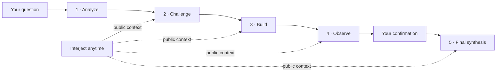

<p align="center">
  
</p>

<h1 align="center">Council Lab</h1>

<p align="center"><strong>Turn one complex question into a decision record you can inspect.</strong></p>

<p align="center">
  Four discussion seats analyze, challenge, build, and observe. A fifth seat synthesizes the agreement, disagreement, risks, and stop conditions.<br>
  You can interject at any time and add facts before the final answer is created.
</p>

<p align="center">
  <a href="https://github.com/loveramarois-byte/council-lab/releases/latest"></a>
  <a href="https://github.com/loveramarois-byte/council-lab/actions/workflows/ci.yml"></a>
  <a href="LICENSE"></a>
  
</p>

<p align="center"><a href="README.md">中文</a> · <a href="#download">Download</a> · <a href="docs/INSTALL.md">Install guide</a> · <a href="SECURITY.md">Security</a> · <a href="CONTRIBUTING.md">Contributing</a></p>


## Complex questions deserve more than one conclusion

A single chat can produce a fluent, confident answer without leaving a path you can audit. Council Lab preserves the public decision path: who proposed each reason, who disagreed, which facts remain unverified, when to stop, and why the final recommendation was reached.

It is built for product trade-offs, architecture, research planning, risk review, and other questions that benefit from explicit challenge. It never displays or stores hidden chain-of-thought. Only public answers and run records are kept.

| A single chat | Council Lab |
| --- | --- |
| One generation returns one answer | Multiple seats surface reasons, counterexamples, and alternatives |
| Assumptions disappear inside prose | Disagreement, limitations, open questions, and minority views stay visible |
| The model decides when it is done | The default workflow pauses for your confirmation |
| The result remains in chat history | A DecisionBrief records reasons, actions, stop conditions, and reopen triggers |

## Start in three steps

1. Download the desktop app from [GitHub Releases](https://github.com/loveramarois-byte/council-lab/releases/latest). Run **Local Demo** first; it is offline, free, and requires no key.
2. Open **Settings → Model Providers**, connect a real provider, and assign models to the four discussion seats and finalizer.
3. Submit a question. Interject during the discussion, then confirm or add facts before final synthesis.

## One deliberation, end to end



**Sequential deliberation** lets later seats read and respond to earlier turns. **Independent first answers** freeze the question and materials, collect four isolated views, then compare them in public. Both workflows support confirmation, recovery, idempotent requests, and report export.

Short definitions and deterministic arithmetic can use one discussion seat plus the finalizer. Decisions, predictions, risks, and ambiguous questions retain the full workflow. The run page shows the seats, models, providers, and reported usage that were actually used.

## Designed for inspection

| Capability | What it means |
| --- | --- |
| Public multi-seat discussion | Fixed roles make answers, objections, and user interjections visible |
| Human confirmation | The default run does not finalize on its own; high-risk runs cannot auto-finalize |
| Recoverable runs | SQLite and LangGraph checkpoints preserve completed work across restarts and disconnects |
| Structured briefs | Store question-specific reasons, support, open issues, actions, stop conditions, and minority views |
| Evidence boundaries | Separate user material, model inference, and unverified claims; agreement is not fact verification |
| Local-first storage | Credentials use the operating-system secret store; run data stays on the current computer by default |
| Paired mobile access | The phone is a controlled remote view; provider calls, keys, and the database remain on the computer |
| Multiple providers | CC Switch, DeepSeek, Zhipu GLM, Kimi, SiliconFlow, OpenAI, and compatible endpoints |

## Live API acceptance

On 2026-08-05, the repository's fixed acceptance set completed 10 full Council runs and 50 logical model requests:

| Configuration | Result |
| --- | --- |
| CC Switch + `gpt-5.6-sol`, four discussion seats and one finalizer | 50 / 50 requests succeeded |
| Failures / retries / fallbacks | 0 / 0 / 0 |
| Provider request latency | P50 9.487 s · P95 44.846 s · max 81.653 s |

The public redacted statistics are available at [`evals/results/live-acceptance-50-summary-2026-08-05.json`](evals/results/live-acceptance-50-summary-2026-08-05.json). This is a release acceptance snapshot for one model, one route, and ten fixed cases. It is not evidence for every provider and is not a model-quality ranking.

## Traditional Culture Council

Traditional Culture mode does not ask one model to make a definitive prediction. It places local chart calculation, reference directions, school comparison, falsification, and limitations in one public research flow:

`local snapshot → choose reference directions → four independent reviews → calendar and school comparison → falsification → user confirmation`

- The local service recomputes and signs a version-pinned snapshot. Raw birthplace text is neither sent to model seats nor included in reports.
- Network time requires agreement across multiple HTTPS time sources. True solar time correction records the city-level coordinates, civil time, and adjustment.
- Works are exposed as title, topic, and school indexes only. Council does not bundle full text or present an index as a quotation.
- The final answer starts in plain language, then explains computed fields, traditional interpretation, school disagreement, and counterevidence.
- Traditional interpretation is not scientifically validated, carries no accuracy percentage, and must not guide medical, legal, investment, compliance, or production decisions.

Read the full [mode boundary](docs/TRADITIONAL_CULTURE_MODE.md) and [third-party notices](NOTICE).

## Download

### macOS

1. Download the latest `Council-v*-macOS.zip`.
2. Unzip it and double-click **`Council.app`**.

The package includes its runtime; Python and Node.js are not required. The current open-source build is not Apple-notarized. If macOS blocks the first launch, Control-click the app, choose **Open**, and confirm.

### Windows 10 / 11

1. Download `Council-v*-Windows.zip` and choose **Extract All**.
2. Double-click **`Start Council.cmd`**. Run **`Create Desktop Shortcut.cmd`** only if needed.

The Windows package also includes its runtime and requires no administrator access. It is not commercially code-signed. If SmartScreen appears, verify that the file came from the official Release before choosing **More info → Run anyway**.

Formal releases include `SHA256SUMS.txt` and a GitHub build-provenance attestation. The checksum verifies content; the attestation links an artifact to a workflow and commit. Neither replaces platform signing.

### Mobile access and updates

Keep Council running on the computer and pair under **Settings → Mobile Access**. The phone stores neither provider keys nor a second database. Sessions last at most 12 hours, can be revoked from the desktop, and expire when Council restarts. LAN access uses plain HTTP, so do not use it on open public Wi-Fi.

The desktop app can download, verify, replace, and restart itself under **Settings → Software Update** without overwriting local history or credentials.

## Provider and data boundaries

Real providers receive your question and selected public context and may charge for requests. `Quick / Standard / Rigorous` are Council workflow tiers, not automatic aliases for an upstream model's Low / High / Ultra settings. Native reasoning effort is sent only when the provider and protocol explicitly support it.

- API keys never enter Council SQLite, logs, or browser storage. The desktop app uses macOS Keychain, Windows Credential Manager, or Linux Secret Service.
- The browser talks only to the same-origin Next.js proxy. Every FastAPI route except health requires a launcher-generated internal token.
- Run data defaults to `~/Library/Application Support/Council/data/` on macOS, `%LOCALAPPDATA%\\Council\\data\\` on Windows, and `${XDG_DATA_HOME:-~/.local/share}/council/data/` on Linux.
- Schema upgrades create a consistency backup and restore it on migration failure. This is not an off-machine backup.
- The CC Switch integration reads only observable local routing state. It does not read or modify CC Switch credentials.

Also read [SECURITY.md](SECURITY.md), the [threat model](docs/THREAT_MODEL.md), [redacted diagnostics](docs/DIAGNOSTICS.md), and the [CC Switch integration boundary](docs/CCSWITCH_INTEGRATION.md).

## Development

Source development requires Python 3.12+ and Node.js 22+:

```bash
git clone https://github.com/loveramarois-byte/council-lab.git
cd council-lab
./setup.sh
./start.sh
```

Council opens at <http://localhost:3000>. Linux is supported through the source workflow. See [docs/INSTALL.md](docs/INSTALL.md) for setup and troubleshooting.

```text
backend/       FastAPI, orchestration, providers, context, and persistence
frontend/      Next.js, React, and TypeScript workspace
macos/         Native SwiftUI and WKWebView shell for macOS
desktop/       Desktop install, launch, stop, and compatibility scripts
docs/          Architecture, evaluation, security, and integration notes
```

## Project boundary

Version `0.15.7` is intended for personal research, planning, and non-binding multi-perspective decision support. Council does not perform external web or code-sandbox verification. High-risk mode can record evidence, reviews, and responsibility statements, but it does not verify licenses and is not a medical device, legal service, investment adviser, or compliance certification. Do not use model output directly for high-risk execution.

Council Lab thanks the [LINUX DO](https://linux.do/) community for supporting open-source exchange and the project's growth.

Copyright 2026 Council Lab contributors. Licensed under the [Apache License 2.0](LICENSE). Council Lab is not affiliated with, authorized by, or endorsed by the CC Switch project.
