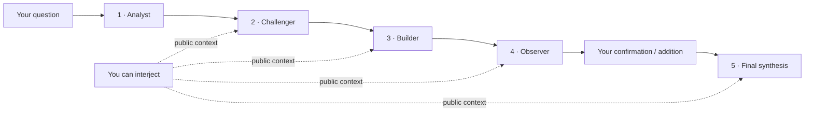

<p align="center">
  
</p>

<h1 align="center">Turn a complex question into a decision record you can inspect.</h1>

<p align="center">
  Council Lab is not another chat window. Multiple model seats think independently, challenge one another in public, compare trade-offs, and keep your confirmation, unresolved risks, and next steps with the result.
</p>

<p align="center">
  <a href="https://github.com/loveramarois-byte/council-lab/releases/latest"></a>
  <a href="https://github.com/loveramarois-byte/council-lab/actions/workflows/ci.yml"></a>
  <a href="LICENSE"></a>
  
</p>

<p align="center"><a href="README.md">中文说明</a> · <a href="https://github.com/loveramarois-byte/council-lab">GitHub</a> · <a href="https://gitee.com/bbbbo-liu/council-lab">Gitee</a> · <a href="#traditional-culture-council">Traditional culture</a> · <a href="#download-and-run">Download</a> · <a href="docs/INSTALL.md">Install guide</a> · <a href="CONTRIBUTING.md">Contributing</a></p>


## Start here

| You want to | Start with |
| --- | --- |
| Try the complete workflow | Download a desktop release and choose **Local Demo**. It is offline, free, and needs no key. |
| Use a real model | Open **Settings -> Model Providers**, connect a provider, and assign models to the five seats. |
| Use your phone | Keep Council running on the computer, then pair under **Settings -> Mobile Access**. The phone is a remote interface, not a second data store. |

## The value

The risk in a complex decision is often not having no answer. It is having **one confident answer without knowing what it missed**. Council turns a single chat into an inspectable decision path:

| From | To |
| --- | --- |
| One model returns a smooth conclusion | Multiple seats expose reasons, counterexamples, options, and risks |
| Assumptions stay hidden inside prose | Assumptions, disagreement, evidence gaps, and minority views are visible |
| The model decides when the conversation is over | The run pauses for your facts and confirmation before final synthesis |
| The result disappears into chat history | A DecisionBrief records the choice, actions, reopen conditions, and later outcomes |

Council is designed for product trade-offs, architecture, research planning, risk review, and other questions that benefit from explicit challenge. It is not a source of verified medical, legal, investment, compliance, or production instructions.

Council stores public model responses and run metadata. It never displays or saves hidden chain-of-thought.

## Deliberation flow



In sequential mode, each later seat reads and answers the public discussion. In independent mode, all four seats first read only the frozen question and shared evidence, then compare their positions. Both modes share confirmation, recovery, idempotency, and export behavior.

Short definitions and deterministic arithmetic can use one discussion seat plus the finalizer. Decisions, risks, predictions, ambiguous quantities, and high-risk topics keep the full workflow. The run page shows the active seats and provider-reported usage.

## Core capabilities

| Capability | What it means |
| --- | --- |
| Sequential or independent deliberation | `Analyst -> Challenger -> Builder -> Observer`, or four independent first opinions followed by public comparison. |
| Human confirmation | The default run pauses after discussion; high-risk runs cannot auto-finalize. |
| Recoverable runs | SQLite and LangGraph checkpoints preserve progress across restarts, disconnects, and enforced limits. |
| Cost-aware mutations | Run creation, progress, interjections, retries, resume, and finalization use persisted idempotency keys. |
| Structured output | Completed runs can expose a DecisionBrief, claim provenance, minority views, follow-up outcomes, and Markdown/HTML reports. |
| Multiple providers | CC Switch, DeepSeek, Zhipu GLM, Kimi, SiliconFlow, OpenAI, compatible endpoints, and Mock. |
| Paired mobile access | Keys and data stay on the computer; the phone uses a short-lived signed session. |
| Reproducible evaluation | Built-in cases and scoring paths; Mock or incomplete blind reviews cannot support quality claims. |

## Three ways to run it

| Mode | Good for | Important boundary |
| --- | --- | --- |
| **Local Demo** | First launch and offline testing | Fixed Mock responses; it is not evidence of real-model quality. |
| **Real provider** | Research, planning, and complex discussions | Your question and public context go to the selected service and may incur charges. Agreement is not fact verification. |
| **CC Switch** | Existing local model routing | Council only uses route state it can observe; it does not read or modify CC Switch credentials. |

## Traditional Culture Council

Instead of asking one model for a definitive reading, Council turns traditional-culture research into an inspectable workflow that ends with human confirmation:

`local chart snapshot -> select reference directions -> four-seat research -> calendar check -> source comparison -> school comparison -> falsification -> your confirmation`

- **Local and reproducible**: the browser submits raw chart inputs only; the local Next service recomputes and signs the snapshot with version-pinned engines. Raw birthplace text is neither sent to model seats nor written into reports; model seats receive only the city-level resolution and computed values.
- **Network time and true solar time**: when online, Council requires at least two agreeing HTTPS `Date` responses from Cloudflare, Google, and Baidu, then binds that result to a short-lived proof issued by the current backend. A recognized city can apply longitude and equation-of-time correction.
- **Explicit timing fields**: the snapshot lists the birth day/hour pillars, the consultation year's/month's/day's/hour's pillars, and the adjacent solar-term transition times.
- **Four-seat review**: seats inspect the same snapshot, compare sources and interpretive schools, and actively look for counterexamples.
- **Selectable references**: chosen directions become part of the frozen snapshot, model context, result page, and exported report.
- **No invented sourcing**: Council sends title, topic, and school metadata only. It does not bundle classical texts or present an index as a quotation.

Available directions include *Qiong Tong Bao Dian* (also known as *Qiong Tong Bao Jian*), *San Ming Tong Hui*, *Di Tian Sui*, *Yuan Hai Zi Ping*, *Qian Li Ming Gao*, *Xie Ji Bian Fang Shu*, *Guo Lao Xing Zong*, *Zi Ping Zhen Quan*, *Shen Feng Tong Kao*, *Zhou Yi*, *Zi Wei Dou Shu Quan Shu*, *Xing Ping Hui Hai*, *Ming Li Yue Yan*, *Zao Hua Yuan Yue*, and *Bu Shi Zheng Zong*.

These are research indexes, not bundled full text, automatic citations, or scientific validation. Traditional interpretation and prediction must not be used as medical, legal, investment, compliance, or production guidance. See the full [Traditional Culture Mode boundary](docs/TRADITIONAL_CULTURE_MODE.md).

## Read the boundaries first

- **No external verification yet**: Council does not run web search or a code sandbox, and it does not produce percentage fact confidence. The final answer is a synthesis of the public discussion.
- **High-risk is decision support only**: Medical, legal, investment, compliance, and production-incident modes require evidence, independent verification, domain review, and separation of duties. They do not verify licenses or execute prescriptions, trades, filings, releases, or production changes. See [SECURITY.md](SECURITY.md).
- **Traditional culture is not a scientific claim**: The optional mode uses the local service to create and sign a version-pinned calendar/chart snapshot, and offers research indexes for works such as *Qiong Tong Bao Dian*, *San Ming Tong Hui*, *Di Tian Sui*, *Yuan Hai Zi Ping*, *Xie Ji Bian Fang Shu*, *Guo Lao Xing Zong*, *Zi Ping Zhen Quan*, and *Shen Feng Tong Kao*. These are title/topic metadata, not bundled full text or fabricated citations. Raw birthplace text stays on the local machine and is excluded from reports; model seats receive only a city-level resolution and computed values. HTTPS consensus is second-level network time with a short-lived server proof, not dedicated NTP or observatory time. See [the mode boundary](docs/TRADITIONAL_CULTURE_MODE.md) and [third-party notices](NOTICE).
- **Local-first is not automatic backup**: Keys use the operating-system credential store and run data stays on the machine. Inspect reports and diagnostic bundles before sharing them.

## Download and run

### macOS

1. Download `Council-v*-macOS.zip` from [GitHub Releases](https://github.com/loveramarois-byte/council-lab/releases/latest) or [Gitee Releases](https://gitee.com/bbbbo-liu/council-lab/releases).
2. Unzip it and double-click **`Council.app`**.

The release includes its own runtime. Python and Node.js are not required. This open-source build is not Apple-notarized; if macOS blocks the first launch, Control-click `Council.app`, choose **Open**, and confirm.

### Windows 10 / 11

1. Download `Council-v*-Windows.zip` from either release page.
2. Choose **Extract All**, then double-click **`Start Council.cmd`**.

The release needs neither administrator access nor a separate Python/Node.js installation. This open-source build is not commercially code-signed. If SmartScreen appears, verify the Release source, then choose **More info -> Run anyway**. `Create Desktop Shortcut.cmd` is optional.

Every formal release includes `SHA256SUMS.txt` and a GitHub build-provenance attestation. The checksum verifies the downloaded content; the attestation links the package to a workflow and commit. Neither replaces platform signing.

### Mobile access

1. Start Council on the computer and leave it running.
2. Open **Settings -> Mobile Access** and keep both devices on a trusted private Wi-Fi network.
3. Scan the pairing code. Use **Add to Home Screen** in Safari or Chrome if you want an app-like shortcut.

Model requests still originate from the computer. API keys, CC Switch, and deliberation data are not moved to the phone. A signed mobile session lasts at most 12 hours, can be revoked from the desktop, and is invalidated when Council restarts.

LAN access uses plain HTTP. Do not expose it on open public Wi-Fi; see the [mobile access threat model](docs/THREAT_MODEL.md).

### Updating an installed copy

Council checks the official Release on launch. Open **Settings -> Software Update** to download, verify SHA-256, replace, and restart the installed copy. Local history and credentials are not overwritten. Versions `v0.3.0` and earlier do not contain the updater and must be installed manually once.

## First connection

1. Run one question with **Local Demo** to verify the full workflow.
2. Open **Settings -> Model Providers** and choose DeepSeek, Zhipu GLM, Kimi, SiliconFlow, OpenAI, CC Switch, or a compatible endpoint.
3. Select **Get API Key**, paste the key, and choose **Save and test**. Council reads the provider's live model catalog and performs a minimal generation test.

If discovery fails, built-in values are labelled as offline recommendations. They are troubleshooting hints, not claims about models enabled for your account; the provider's live `/models` response remains authoritative.

## Providers

| Provider | Setup | Model discovery |
| --- | --- | --- |
| CC Switch | Local route; no key re-entry | Live route catalog or read-only recent successful model history |
| DeepSeek | API key | Live catalog plus labelled offline recommendations |
| Zhipu GLM | API key | Live catalog plus labelled offline recommendations |
| Kimi | API key | Live catalog plus labelled offline recommendations |
| SiliconFlow | API key | Live catalog |
| OpenAI | API key | Live catalog plus labelled offline recommendations |
| Compatible endpoint | URL and optional key | Live catalog or manual model ID |
| Local Demo | No setup | Built-in Mock only |

Real providers receive your question and selected public context and may charge for requests. `Quick / Standard / Rigorous` are Council workflow tiers, not automatically the upstream model's Low / High / Ultra settings. Native reasoning effort is sent only where the provider and protocol explicitly support it.

## Privacy and security

- Provider keys stay in macOS Keychain, Windows Credential Manager, or Linux Secret Service, not Council SQLite, logs, or browser storage.
- The browser uses the same-origin Next.js proxy. Every FastAPI route except health requires a launcher-generated internal token and rejects foreign origins, cross-site fetch metadata, and unknown hosts. CORS is not treated as CSRF protection.
- Run data defaults to `~/Library/Application Support/Council/data/` on macOS, `%LOCALAPPDATA%\\Council\\data\\` on Windows, and `${XDG_DATA_HOME:-~/.local/share}/council/data/` on Linux.
- Schema upgrades create a consistency backup before migration and restore it on failure. That is an upgrade rollback mechanism, not an off-machine backup.
- The retired legacy workspace is read-only by default; write APIs return `410 FEATURE_RETIRED`.
- The backend listens on loopback by default. Do not expose local credential endpoints to an untrusted network.

See [SECURITY.md](SECURITY.md), the [redacted diagnostics guide](docs/DIAGNOSTICS.md), and the [CC Switch integration boundary](docs/CCSWITCH_INTEGRATION.md).

## Development and project layout

Source development requires Python 3.12+ and Node.js 22+:

```bash
git clone https://github.com/loveramarois-byte/council-lab.git
cd council-lab
./setup.sh
./start.sh
```

Council opens at <http://localhost:3000>. Linux is supported through the source workflow. See [docs/INSTALL.md](docs/INSTALL.md) for setup and troubleshooting.

```text
backend/       FastAPI, workflow, providers, context, and persistence
frontend/      Next.js, React, and TypeScript workspace
desktop/       macOS / Windows install and launch scripts
docs/          Architecture, decisions, evaluation, and integration notes
.github/       CI, Release, Issue, and dependency-update configuration
```

## Status and license

Version `0.15.3` is intended for personal research, planning, and non-binding multi-perspective decision support. High-risk mode records evidence verification and professional attestations but does not verify licenses or constitute regulated professional advice. Do not use its output directly for high-risk execution.

## Community thanks

Council Lab thanks the [LINUX DO](https://linux.do/) community and its members for supporting open-source exchange, software development, and the project's growth.

Apache-2.0. See [LICENSE](LICENSE), [SECURITY.md](SECURITY.md), and [CONTRIBUTING.md](CONTRIBUTING.md).
