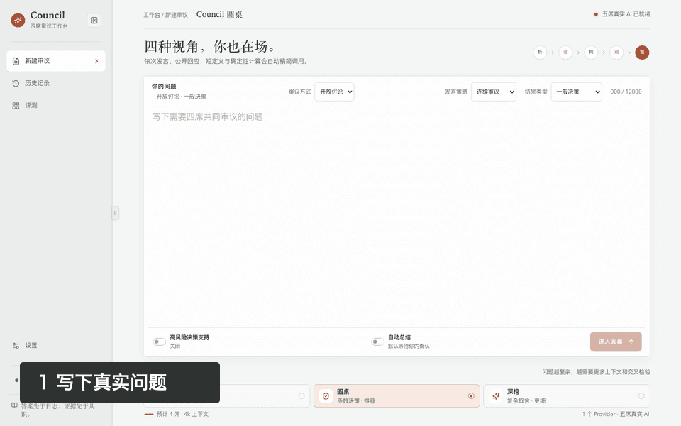
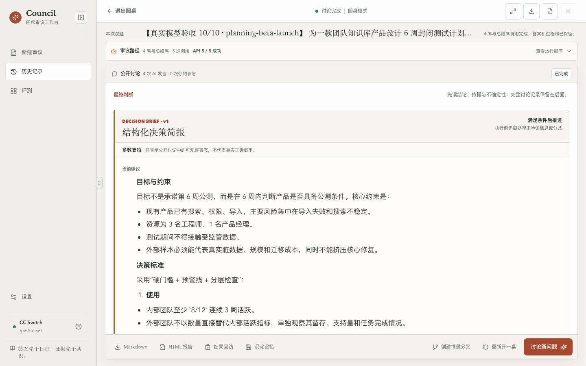
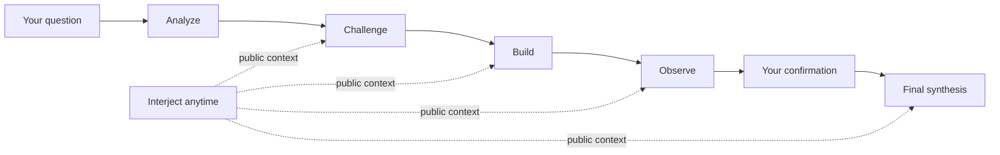

<p align="center">
  
</p>

<h1 align="center">Council</h1>

<p align="center"><strong>Complex questions deserve more than one voice.</strong></p>

<p align="center">
  Four distinct seats analyze and challenge one another in public.<br>
  Once you confirm the boundaries, Council delivers a decision brief you can revisit and act on.
</p>

<p align="center">
  <a href="https://github.com/loveramarois-byte/council-lab/releases/download/v0.18.3/Council-v0.18.3-macOS.zip"><strong>Download for macOS</strong></a>
  &nbsp;&nbsp;·&nbsp;&nbsp;
  <a href="https://github.com/loveramarois-byte/council-lab/releases/download/v0.18.3/Council-v0.18.3-Windows.zip"><strong>Download for Windows</strong></a>
</p>

<p align="center"><sub>Free and open source · Local-first · Try the local demo without an API key</sub></p>

<p align="center"><a href="README.md">中文</a> · <a href="#start-in-three-steps">Get started</a> · <a href="docs/INSTALL.md">Installation</a> · <a href="SECURITY.md">Security</a></p>



## Council in 30 seconds

> **Ask a real question → four seats analyze and challenge → add facts at any time → confirm and receive a `DecisionBrief`**

Council does not stack four answers on top of each other. Later seats can respond to the public record, or independent first answers can isolate viewpoints before comparison. Disagreement, open questions, and minority views are not quietly erased by the final summary.

| A regular chat | Council |
| --- | --- |
| One model generates an answer | Analyze, challenge, build, and observe in sequence |
| Assumptions disappear inside prose | Counterexamples, limits, and open issues remain visible |
| The model decides when it is done | The workflow pauses for your confirmation by default |
| The result stays in chat history | Reasons, actions, stop conditions, and reopen triggers are recorded |

Council never displays or stores hidden chain-of-thought. What you can inspect is the public discussion, your own interjections, and the structured result.

## Turn discussion into action



Every run preserves how the decision took shape instead of leaving only a plausible-sounding conclusion:

- **Public discussion:** inspect viewpoints, counterexamples, and how your additions changed later judgments.
- **Human confirmation:** approve the final synthesis; high-risk runs cannot finalize automatically.
- **Structured briefs:** keep reasons, open issues, actions, stop conditions, and reopen triggers separate.
- **Evidence boundaries:** distinguish user material, model inference, and unverified claims; agreement never becomes fact.
- **Resumable runs:** continue after a disconnect, closed window, or restart without paying to rerun completed work.

## Start in three steps

You do not need to understand models, providers, or workflows first.

1. Download the desktop app and choose **Local Demo**. It is offline, free, and needs no API key.
2. Ask a real question and watch the seats break it down. Interject or add facts whenever you need to.
3. When you want real models, open **Settings → Model Providers** and connect CC Switch, OpenAI, or a compatible service.

If you are unsure which depth to use, keep the default **Roundtable** mode. Use **Guided** for simple definitions and deterministic calculations; use **Deep** for complex strategy, material risk, and ambiguous questions.

Both desktop packages include Python, Node.js, and their required dependencies. Your API key never enters Council's database, logs, or browser storage.

### Not sure what to ask? Start here

- **Product decision:** Should we launch a paid plan within six weeks? Review user value, validation cost, failure conditions, and stop conditions.
- **Technical plan:** What are the main failure modes in this database migration? Give staged checks, rollback steps, and a launch gate.
- **Information review:** Sort these materials into verified facts, claims to verify, critical gaps, and questions for a qualified professional.

## How the four seats work



**Sequential deliberation** lets later seats read and respond to earlier turns. **Independent first answers** freeze the question and materials, collect isolated views, then compare them in public. Every step shows the roles, models, providers, and usage actually involved.

## Clear boundaries for professional questions

Council includes templates for general decisions, product reviews, architecture reviews, and medical, legal, and financial information organization. A template changes the facts it requests, the risks it surfaces, and the shape of the brief. It does not expand the product's authority.

| Area | Council can | Council will not |
| --- | --- | --- |
| Medical | Organize symptoms, timelines, red flags, and questions for care | Diagnose or decide treatment |
| Legal | Organize facts, deadlines, jurisdiction, and questions for counsel | Provide legal advice or file documents |
| Financial | Organize goals, horizon, liquidity, fees, and risk | Give investment advice or place trades |
| Technical | Review architecture, risk, verification, and rollback conditions | Execute production changes without approval |

Missing critical facts, stale evidence, or a safety objection can block a high-risk run from producing an actionable conclusion. Professional modes support decisions; they do not replace professionals. Council does not verify licenses, prescribe medication, place trades, file legal documents, or execute production changes.

## Download and install

### macOS

Download [`Council-v0.18.3-macOS.zip`](https://github.com/loveramarois-byte/council-lab/releases/download/v0.18.3/Council-v0.18.3-macOS.zip), unzip it, and double-click `Council.app`. The open-source build is not Apple-notarized. If macOS blocks the first launch, Control-click the app, choose **Open**, and confirm.

### Windows 10 / 11

Download [`Council-v0.18.3-Windows.zip`](https://github.com/loveramarois-byte/council-lab/releases/download/v0.18.3/Council-v0.18.3-Windows.zip), choose **Extract All**, then double-click `Start Council.cmd`. No administrator access is required. The build is not commercially code-signed. If SmartScreen appears, confirm the file came from this repository's Release before choosing **More info → Run anyway**.

Every formal Release includes `SHA256SUMS.txt` and GitHub build-provenance attestation. The desktop app can check for new versions and open the official Release under **Settings → Software Update**; current public builds do not execute downloaded packages in-app. Manual installation does not overwrite local history or credentials.

## Data and credentials

Real providers receive your question and selected public context and may charge for requests. `Guided / Roundtable / Deep` are Council workflow tiers, not automatic aliases for an upstream model's reasoning effort.

- API keys never enter SQLite, logs, or browser storage. Desktop builds use macOS Keychain, Windows Credential Manager, or Linux Secret Service.
- Run records stay on the current computer by default. A paired phone is a remote interface; provider calls, keys, and the database remain on the computer.
- Mobile pairing lasts at most 12 hours, can be revoked on the computer, and expires when Council restarts. Do not use LAN access on open public Wi-Fi.
- Schema upgrades create a consistency backup and restore it after migration failure. This is not an off-machine backup.

<details>
<summary>Default storage paths and local service boundary</summary>

Run data defaults to `~/Library/Application Support/Council/data/` on macOS, `%LOCALAPPDATA%\\Council\\data\\` on Windows, and `${XDG_DATA_HOME:-~/.local/share}/council/data/` on Linux. The browser talks only to the same-origin Next.js proxy; every FastAPI route except health requires a launcher-generated internal token.

</details>

Read the [security boundary](SECURITY.md), [threat model](docs/THREAT_MODEL.md), [redacted diagnostics guide](docs/DIAGNOSTICS.md), and [CC Switch integration boundary](docs/CCSWITCH_INTEGRATION.md).

## Public verification

On 2026-08-05, the repository's fixed acceptance set completed 10 full runs and 50 logical model requests using `CC Switch + gpt-5.6-sol`: `50 / 50` succeeded, with `0` failures, retries, or fallbacks. Provider latency was P50 `9.487s`, P95 `44.846s`, and max `81.653s`.

The redacted results are in [`live-acceptance-50-summary-2026-08-05.json`](evals/results/live-acceptance-50-summary-2026-08-05.json). This is release acceptance evidence for one model, one route, and a fixed case set. It does not represent every provider and is not a model-quality ranking.

## Development

Source development requires Python 3.12+ and Node.js 22+:

```bash
git clone https://github.com/loveramarois-byte/council-lab.git
cd council-lab
./setup.sh
./start.sh
```

Linux is supported through the source workflow. See [docs/INSTALL.md](docs/INSTALL.md) for setup and troubleshooting, [docs/ARCHITECTURE.md](docs/ARCHITECTURE.md) for architecture, and [CONTRIBUTING.md](CONTRIBUTING.md) to contribute.

---

Version `0.18.3` is open source under the [Apache License 2.0](LICENSE). Thanks to the [LINUX DO](https://linux.do/) community for supporting open exchange and the project's growth. Council Lab is not affiliated with, authorized by, or endorsed by the CC Switch project.
