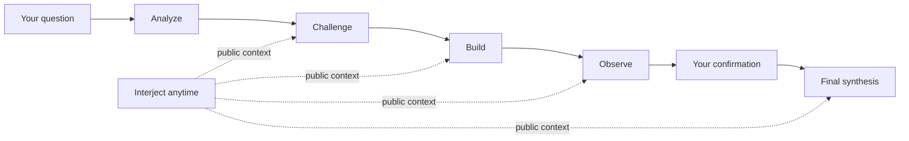

<p align="center">
  
</p>

<h1 align="center">Council</h1>

<p align="center"><strong>Complex questions deserve more than one voice.</strong></p>

<p align="center">
  Four seats deliberate in public. You can step in at any time.<br>
  What remains is a decision you can revisit, challenge, and act on.
</p>

<p align="center">
  <a href="https://github.com/loveramarois-byte/council-lab/releases/download/v0.17.0/Council-v0.17.0-macOS.zip"><strong>Download for macOS</strong></a>
  &nbsp;&nbsp;·&nbsp;&nbsp;
  <a href="https://github.com/loveramarois-byte/council-lab/releases/download/v0.17.0/Council-v0.17.0-Windows.zip"><strong>Download for Windows</strong></a>
</p>

<p align="center"><sub>Free and open source · Local-first · Runtime included</sub></p>

<p align="center"><a href="README.md">中文</a> · <a href="#your-first-run">Get started</a> · <a href="docs/INSTALL.md">Installation</a> · <a href="SECURITY.md">Security</a></p>


## See how a decision takes shape

A regular chat gives you an answer. Council preserves the public path behind it: who made each case, who challenged it, which facts remain unverified, when to stop, and why the final recommendation was reached.

Council never displays or stores hidden chain-of-thought. What you can inspect is the public discussion, your own interjections, and a structured `DecisionBrief`.

| A regular chat | Council |
| --- | --- |
| One model generates one answer | Four roles analyze, challenge, build, and observe |
| Assumptions disappear inside prose | Disagreement, limits, open issues, and minority views remain visible |
| The model decides when it is done | The default workflow pauses for your confirmation |
| The result stays in chat history | Reasons, actions, stop conditions, and reopen triggers are recorded |

## Your first run

You do not need to understand models, providers, or workflows first.

1. Download the desktop app and choose **Local Demo**. It is offline, free, and needs no API key.
2. Ask a real question and watch the four seats respond. Interject or add facts whenever you need to.
3. When you want real models, open **Settings → Model Providers** and connect CC Switch, OpenAI, or a compatible service.

Both desktop packages include Python, Node.js, and their required dependencies. Your API key never enters Council's database, logs, or browser storage.

## A deliberation you can join



**Sequential deliberation** lets later seats read and respond to earlier turns. **Independent first answers** freeze the question and materials, collect isolated views, then compare them in public. Short definitions and deterministic calculations can use a shorter path; decisions, predictions, risks, and ambiguous questions retain the full council.

Every step shows the roles, models, providers, and usage actually involved. If you close the window, lose the connection, or restart, completed work can resume instead of being paid for again.

## More than a conclusion

| What you get | Why it matters |
| --- | --- |
| Public multi-seat discussion | Inspect viewpoints, counterexamples, and your own interjections instead of trusting the last paragraph |
| Human confirmation | You approve the final synthesis; high-risk runs cannot finalize automatically |
| Structured briefs | Keep key reasons, open issues, actions, stop conditions, and reopen triggers separate |
| Evidence boundaries | Distinguish user material, model inference, and unverified claims; agreement never becomes fact |
| Local-first storage | Run data stays on the current computer by default; credentials use the OS secret store |
| Controlled mobile access | The phone is a remote view; provider calls, keys, and the database stay on the computer |

## Built for different questions, not omniscience

Council includes templates for general decisions, product reviews, architecture reviews, and medical, legal, and financial information organization. A template changes the facts it asks for, the risks it surfaces, and the shape of the brief. It does not change the safety boundary.

- Medical mode organizes symptoms, timelines, red flags, and questions for care. It does not diagnose or choose treatment.
- Legal mode organizes facts, deadlines, jurisdiction, and questions for counsel. It is not legal advice.
- Financial mode organizes goals, time horizon, liquidity, fees, and risk. It is not investment advice.
- Missing critical facts, stale evidence, or a safety objection can block a high-risk run from producing an actionable conclusion.

Professional modes support decisions; they do not replace professionals. Council does not verify licenses, prescribe medication, place trades, file legal documents, or execute production changes.

## Download and install

### macOS

Download [`Council-v0.17.0-macOS.zip`](https://github.com/loveramarois-byte/council-lab/releases/download/v0.17.0/Council-v0.17.0-macOS.zip), unzip it, and double-click `Council.app`. The open-source build is not Apple-notarized. If macOS blocks the first launch, Control-click the app, choose **Open**, and confirm.

### Windows 10 / 11

Download [`Council-v0.17.0-Windows.zip`](https://github.com/loveramarois-byte/council-lab/releases/download/v0.17.0/Council-v0.17.0-Windows.zip), choose **Extract All**, then double-click `Start Council.cmd`. No administrator access is required. The build is not commercially code-signed. If SmartScreen appears, confirm the file came from this repository's Release before choosing **More info → Run anyway**.

Every formal Release includes `SHA256SUMS.txt` and GitHub build-provenance attestation. The desktop app can check for new versions and open the official Release under **Settings → Software Update**; current public builds do not execute downloaded packages in-app. Manual installation does not overwrite local history or credentials.

## Where your data lives

Real providers receive your question and selected public context and may charge for requests. `Quick / Standard / Rigorous` are Council workflow tiers, not automatic aliases for an upstream model's reasoning effort.

- API keys never enter SQLite, logs, or browser storage. Desktop builds use macOS Keychain, Windows Credential Manager, or Linux Secret Service.
- The browser talks only to the same-origin Next.js proxy. Every FastAPI route except health requires a launcher-generated internal token.
- Run data defaults to `~/Library/Application Support/Council/data/` on macOS, `%LOCALAPPDATA%\\Council\\data\\` on Windows, and `${XDG_DATA_HOME:-~/.local/share}/council/data/` on Linux.
- Mobile pairing lasts at most 12 hours, can be revoked on the computer, and expires when Council restarts. LAN access uses plain HTTP; do not use it on open public Wi-Fi.
- Schema upgrades create a consistency backup and restore it after migration failure. This is not an off-machine backup.

Read the [security boundary](SECURITY.md), [threat model](docs/THREAT_MODEL.md), [redacted diagnostics guide](docs/DIAGNOSTICS.md), and [CC Switch integration boundary](docs/CCSWITCH_INTEGRATION.md).

## Public verification

On 2026-08-05, the repository's fixed acceptance set completed 10 full runs and 50 logical model requests using `CC Switch + gpt-5.6-sol`: `50 / 50` succeeded, with `0` failures, retries, or fallbacks. Provider latency was P50 `9.487s`, P95 `44.846s`, and max `81.653s`.

The redacted results are in [`live-acceptance-50-summary-2026-08-05.json`](evals/results/live-acceptance-50-summary-2026-08-05.json). This is release acceptance evidence for one model, one route, and a fixed case set. It does not represent every provider and is not a model-quality ranking.

## Development

Source development requires Python 3.12+ and Node.js 22+:

```bash
git clone https://github.com/loveramarois-byte/council-lab.git
cd council-lab
./setup.sh
./start.sh
```

Linux is supported through the source workflow. See [docs/INSTALL.md](docs/INSTALL.md) for setup and troubleshooting, [docs/ARCHITECTURE.md](docs/ARCHITECTURE.md) for architecture, and [CONTRIBUTING.md](CONTRIBUTING.md) to contribute.

---

Version `0.17.0` is open source under the [Apache License 2.0](LICENSE). Thanks to the [LINUX DO](https://linux.do/) community for supporting open exchange and the project's growth. Council Lab is not affiliated with, authorized by, or endorsed by the CC Switch project.
