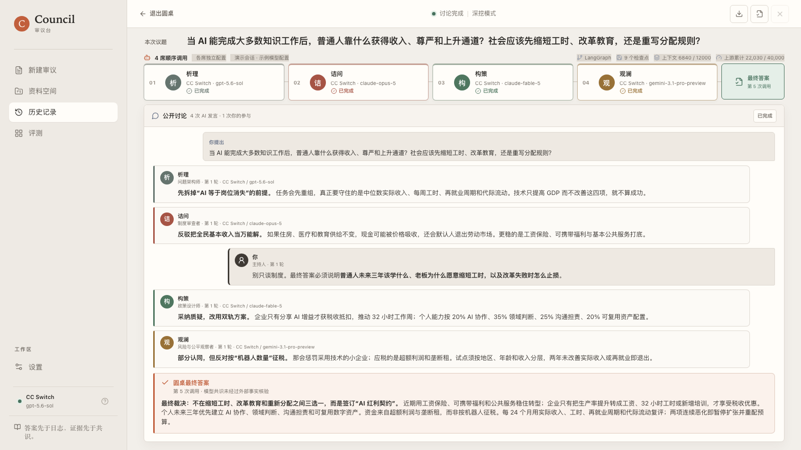
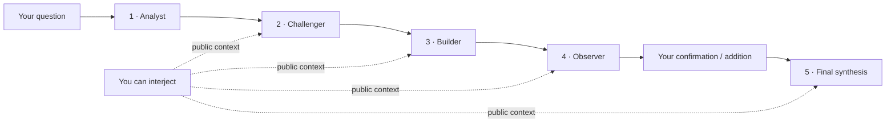

# Council Lab

Council is a local-first, human-participatory AI deliberation workspace. Four seats speak in sequence, respond to earlier arguments, and expose the discussion as it happens. After seat four, Council waits for your confirmation or additions before a fifth model call produces the final answer.

[中文说明](README.md) · [Download](https://github.com/loveramarois-byte/council-lab/releases/latest) · [Install guide](docs/INSTALL.md) · [Contributing](CONTRIBUTING.md)



## Why Council

- **A discussion, not four disconnected answers.** Each later seat must agree, partially agree, or challenge what came before.
- **You remain in the room.** Interjections become public context for later seats and the final synthesis.
- **Independent seat configuration.** Choose a provider and model for each of the four speakers and the finalizer; the configuration is snapshotted per run.
- **A deliberate confirmation point.** Council does not finalize after seat four until you approve or add more context.
- **Explicit first-run setup.** Council distinguishes the local scripted demo from real AI, then guides users through connecting a Provider and assigning all five seats.
- **Decision follow-up.** Record the decision taken, expected result, review date, actual outcome, and which seat hypotheses held up.
- **Recoverable runs.** SQLite persistence and LangGraph checkpoints preserve progress across restarts and enforced run limits.
- **Portable reports.** Export a completed deliberation as Markdown or a self-contained HTML report.
- **Local-first credentials.** API keys are stored in the operating-system credential store, not Council's database or browser storage.
- **Verified in-app updates.** Council checks official releases, verifies the downloaded package against `SHA256SUMS.txt`, replaces the installed copy, and restarts without moving local data or credentials.
- **Reproducible evaluation.** A 12-case benchmark tracks failures, tokens, latency, optional cost estimates, citation support, and unsupported claims without publishing scores from Mock or incomplete blind reviews.

Council never displays or saves hidden chain-of-thought. It stores only public model responses and run metadata. It does not currently run web searches or a code sandbox, and model agreement is **not** external fact verification.

## Download and run

### macOS

1. Download `Council-v*-macOS.zip` from the [latest release](https://github.com/loveramarois-byte/council-lab/releases/latest).
2. Unzip it and double-click **`Council.app`**.
3. Start with **Local Demo**, or open **Settings -> Model Providers** to connect a real API.

The release includes its own runtime. Python and Node.js are not required. This open-source build is ad-hoc signed but not Apple-notarized. If macOS blocks the first launch, Control-click `Council.app`, choose **Open**, and confirm.

### Windows 10 / 11

1. Download `Council-v*-Windows.zip` from the [latest release](https://github.com/loveramarois-byte/council-lab/releases/latest).
2. Right-click the ZIP, choose **Extract All**, and open the extracted folder.
3. Double-click **`Start Council.cmd`**.

The release includes its own runtime and needs neither administrator access nor a separate Python/Node.js installation. This open-source build is not commercially code-signed. If SmartScreen appears, verify that the file came from this repository's Release page, then choose **More info -> Run anyway**. `Create Desktop Shortcut.cmd` adds an optional shortcut.

Every release also includes `SHA256SUMS.txt` for verifying the downloaded ZIP.

### Updating an installed copy

Starting with `v0.4.0`, Council checks the official GitHub Release on launch. Open **Settings -> Software Update** to download, verify, replace, and restart the app. macOS may request system authorization when `Council.app` is in a protected folder. Windows updates the current extracted directory in place, so an existing desktop shortcut remains valid.

Versions `v0.3.0` and earlier do not contain the updater. Install `v0.4.0` manually once; later releases can be installed from inside Council.

## First connection

1. Run one question with **Local Demo**. It is offline, free, and verifies the full four-seat workflow.
2. Open **Settings -> Model Providers** and choose DeepSeek, Zhipu GLM, Kimi, SiliconFlow, OpenAI, CC Switch, or a compatible custom endpoint.
3. Follow **Get API Key**, paste the key, and select **Save and test**. Council stores the key, requests the provider's real model catalog, selects a model, and performs a minimal generation test.

If live model discovery fails, Council labels any built-in values as offline recommendations. They are troubleshooting hints, not claims about models enabled for your account. The live provider response remains authoritative.

## Deliberation flow



Each seat is a separate API call with its own public role prompt. Separate calls do not necessarily mean separate vendors: you may intentionally assign the same provider and model to multiple seats. Agreement between seats is still not proof that a claim is true.

Quick, Standard, and Rigorous are Council workflow and context tiers. Native reasoning effort is sent only by providers and protocols that explicitly support it.

## Providers

| Provider | Setup | Model discovery |
| --- | --- | --- |
| CC Switch | Local route; credentials remain in CC Switch | Live route catalog or read-only recent successful model history |
| DeepSeek | API key | Live catalog with clearly labelled offline recommendations |
| Zhipu GLM | API key | Live catalog with clearly labelled offline recommendations |
| Kimi | API key | Live catalog with clearly labelled offline recommendations |
| SiliconFlow | API key | Live catalog |
| OpenAI | API key | Live catalog with clearly labelled offline recommendations |
| Custom compatible endpoint | URL and optional API key | Live catalog or manual model ID |
| Local Demo | No setup | Built-in Mock only |

Real providers receive your question, selected evidence, and public discussion context and may charge for requests. CC Switch continues to own upstream selection and failover; Council reports only the route state it can directly observe.

## Development

Source development requires Python 3.12+ and Node.js 22+:

```bash
git clone https://github.com/loveramarois-byte/council-lab.git
cd council-lab
./setup.sh
./start.sh
```

Council opens at <http://localhost:3000>. Linux is supported through the source workflow. See [docs/INSTALL.md](docs/INSTALL.md) for paths and troubleshooting.

## Privacy and status

Provider keys stay in macOS Keychain, Windows Credential Manager, or Linux Secret Service. Local runs and compatibility data retained from older releases may contain sensitive material; protect the local account and review content before sharing an exported report.

Version `0.5.1` is intended for personal research, planning, and decision support. Do not rely on unreviewed output for medical, legal, financial, or safety-critical decisions.

Apache-2.0. See [LICENSE](LICENSE), [SECURITY.md](SECURITY.md), and [CONTRIBUTING.md](CONTRIBUTING.md).
