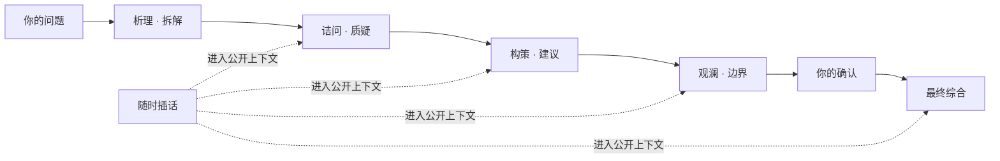

<p align="center">
  
</p>

<h1 align="center">Council</h1>

<p align="center"><strong>复杂问题，不该只有一个声音。</strong></p>

<p align="center">
  四席公开审议。你随时加入。<br>
  最后留下一份能回看、能质疑、能继续行动的决定。
</p>

<p align="center">
  <a href="https://github.com/loveramarois-byte/council-lab/releases/download/v0.17.0/Council-v0.17.0-macOS.zip"><strong>下载 macOS 版</strong></a>
  &nbsp;&nbsp;·&nbsp;&nbsp;
  <a href="https://github.com/loveramarois-byte/council-lab/releases/download/v0.17.0/Council-v0.17.0-Windows.zip"><strong>下载 Windows 版</strong></a>
</p>

<p align="center"><sub>免费开源 · 本地优先 · 安装包内置运行环境</sub></p>

<p align="center"><a href="README.en.md">English</a> · <a href="#第一次打开">开始使用</a> · <a href="docs/INSTALL.md">安装说明</a> · <a href="SECURITY.md">安全边界</a></p>


## 看见一个决定如何形成

普通聊天给你一段答案。Council 保留整条公开路径：谁提出理由，谁给出反例，哪些事实还没验证，什么情况下应该停止，以及最后为什么得到这个结论。

它不会展示或保存模型的隐藏思维链。你看到的，是可以检查的公开发言、你的插话，以及一份结构化的 `DecisionBrief`。

| 普通单次聊天 | Council |
| --- | --- |
| 一个模型生成一个答案 | 四个角色依次拆解、质疑、构建与观察 |
| 假设和分歧埋在长文里 | 分歧、限制、未决问题和少数意见单独保留 |
| 模型决定何时结束 | 默认在最终综合前等待你的确认 |
| 结果停留在聊天记录 | 保存理由、行动、停止条件与重开条件 |

## 第一次打开

不需要先理解模型、Provider 或工作流。

1. 下载并打开桌面版，选择 **本地演示**。它离线、免费、不需要 API Key。
2. 输入一个真实问题，看完四席讨论；你可以在任何时候插话或补充事实。
3. 需要真实模型时，再到 **设置 → 模型供应商** 连接 CC Switch、OpenAI 或兼容服务。

macOS 与 Windows 安装包都自带 Python、Node.js 和所需依赖。你的 API Key 不会进入 Council 数据库、日志或浏览器存储。

## 一场真正可参与的审议



**连续审议**让后续席位阅读并回应前文。**独立初答**先冻结问题和资料，让各席互不读取彼此答案，再公开比较。简单定义或确定性计算可以缩短流程；决策、预测、风险和模糊问题保留完整审议。

每一步都会显示实际使用的角色、模型、Provider 和用量。断线、关闭窗口或重启后，已完成的步骤可以继续，不必从头付费重跑。

## 不只给结论，也保留边界

| 你得到什么 | 它解决什么问题 |
| --- | --- |
| 公开多席讨论 | 看见不同观点、反例和用户插话，而不是只相信最后一段话 |
| 人工确认 | 最终综合前由你确认；高风险流程禁止自动收尾 |
| 结构化简报 | 单独保存关键理由、未决问题、行动、停止与重开条件 |
| 证据边界 | 区分用户资料、模型推断和未核验主张；共识不冒充事实 |
| 本地优先 | 运行记录默认留在当前电脑，凭据进入操作系统安全存储 |
| 可控手机访问 | 手机是远程界面；Provider 请求、Key 和数据库仍在电脑端 |

## 为不同问题准备，而不是假装无所不知

Council 提供一般决策、产品评审、技术架构，以及医疗、法律、财务信息整理模板。不同模板会改变需要补充的事实、风险提示和输出结构，不会改变安全边界。

- 医疗场景用于整理症状、时间线、红旗信号和就医问题，不做诊断或治疗决定。
- 法律场景用于整理事实、时效、司法辖区和待咨询事项，不构成法律意见。
- 财务场景用于整理目标、期限、流动性、费用与风险，不构成投资建议。
- 关键事实缺失、证据过期或存在安全异议时，高风险流程会阻止形成可执行结论。

专业模式是决策支持，不是专业人士的替代品。Council 不验证执照，也不会开药、交易、提交法律文件或执行生产变更。

## 下载与安装

### macOS

下载 [`Council-v0.17.0-macOS.zip`](https://github.com/loveramarois-byte/council-lab/releases/download/v0.17.0/Council-v0.17.0-macOS.zip)，解压后双击 `Council.app`。当前开源构建尚未经过 Apple 公证；如果首次启动被拦截，请按住 Control 点击 App，选择 **打开** 并确认。

### Windows 10 / 11

下载 [`Council-v0.17.0-Windows.zip`](https://github.com/loveramarois-byte/council-lab/releases/download/v0.17.0/Council-v0.17.0-Windows.zip)，选择 **全部解压**，再双击 `Start Council.cmd`。不需要管理员权限。当前构建没有商业代码签名；如 SmartScreen 提示，请先确认文件来自本仓库 Release，再选择 **更多信息 → 仍要运行**。

正式 Release 同时提供 `SHA256SUMS.txt` 和 GitHub 构建来源证明。桌面版可以在 **设置 → 软件更新** 检查新版本并打开官方 Release；当前公开构建不会在应用内自动执行下载包。手动安装不会覆盖本地历史和凭据。

## 数据留在哪里

真实 Provider 会收到你的问题和所选公开上下文，并可能产生费用。`Quick / Standard / Rigorous` 是 Council 的工作流档位，不自动等于上游模型的推理强度。

- API Key 不写入 SQLite、日志或浏览器存储；桌面端使用 macOS Keychain、Windows Credential Manager 或 Linux Secret Service。
- 浏览器只访问 Next.js 同源代理；FastAPI 除健康检查外都要求启动器生成的内部令牌。
- 审议记录默认位于 macOS 的 `~/Library/Application Support/Council/data/`、Windows 的 `%LOCALAPPDATA%\\Council\\data\\`，或 Linux 的 `${XDG_DATA_HOME:-~/.local/share}/council/data/`。
- 手机配对会话最长 12 小时，可在电脑端撤销，Council 重启后自动失效。局域网连接使用普通 HTTP，不要在开放公共 Wi-Fi 使用。
- Schema 升级前会创建一致性备份，迁移失败则恢复；这不是异机备份。

详见 [安全边界](SECURITY.md)、[威胁模型](docs/THREAT_MODEL.md)、[脱敏诊断](docs/DIAGNOSTICS.md) 和 [CC Switch 集成边界](docs/CCSWITCH_INTEGRATION.md)。

## 公开验证

2026-08-05，仓库固定验收集在 `CC Switch + gpt-5.6-sol` 上完成 10 个完整 Run、50 次逻辑模型请求：`50 / 50` 成功，失败、重试、降级均为 `0`。Provider 延迟为 P50 `9.487s`、P95 `44.846s`、最大 `81.653s`。

脱敏统计见 [`live-acceptance-50-summary-2026-08-05.json`](evals/results/live-acceptance-50-summary-2026-08-05.json)。这是单一模型、单一路由和固定案例的发布验收，不代表所有 Provider，也不是模型质量排名。

## 开发

源码开发需要 Python 3.12+ 和 Node.js 22+：

```bash
git clone https://github.com/loveramarois-byte/council-lab.git
cd council-lab
./setup.sh
./start.sh
```

Linux 通过源码方式支持。完整安装和排错见 [docs/INSTALL.md](docs/INSTALL.md)，架构见 [docs/ARCHITECTURE.md](docs/ARCHITECTURE.md)，贡献说明见 [CONTRIBUTING.md](CONTRIBUTING.md)。

## 社区致谢

Council Lab 认可并感谢 [LINUX DO](https://linux.do/) 社区及佬友们对开源交流、软件开发和项目成长提供的支持。

---

Council 当前版本为 `0.17.0`，以 [Apache License 2.0](LICENSE) 开源。Council Lab 与 CC Switch 项目没有官方隶属、授权或背书关系。
