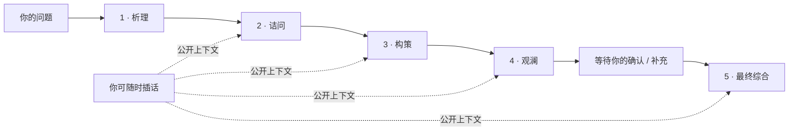

<p align="center">
  
</p>

<h1 align="center">把复杂问题，从一个答案变成一份可检查的决策记录。</h1>

<p align="center">
  Council Lab 不是另一个聊天窗口。它让多个模型席位围绕同一个问题独立思考、公开质询、比较取舍，并把你的确认、未决风险和下一步一起留下来。
</p>

<p align="center">
  <a href="https://github.com/loveramarois-byte/council-lab/releases/latest"></a>
  <a href="https://github.com/loveramarois-byte/council-lab/actions/workflows/ci.yml"></a>
  <a href="LICENSE"></a>
  
</p>

<p align="center"><a href="README.en.md">English</a> · <a href="https://github.com/loveramarois-byte/council-lab">GitHub</a> · <a href="https://gitee.com/bbbbo-liu/council-lab">Gitee</a> · <a href="#传统文化联合研判">传统文化</a> · <a href="#下载使用">下载</a> · <a href="docs/INSTALL.md">安装文档</a> · <a href="CONTRIBUTING.md">参与贡献</a></p>


## 先看这里

| 你想做什么 | 从这里开始 |
| --- | --- |
| 先体验完整流程 | 下载桌面包，选择 **本地演示**；不联网、不需要密钥，也不产生模型费用。 |
| 使用真实模型 | 在 **设置 → 模型供应商** 连接 Provider，再为五个席位分配模型。 |
| 远程使用 | 电脑保持运行，在 **设置 → 手机连接** 扫码配对；手机只是电脑端的远程界面。 |

## 这款软件的价值

复杂问题真正危险的地方，通常不是“没有一个答案”，而是**只有一个答案，却不知道它漏掉了什么**。Council 把单次对话改造成一条可检查的决策路径：

| 从 | 到 |
| --- | --- |
| 一个模型给出一段顺滑结论 | 多个席位分别提出依据、反例、方案和风险 |
| 假设藏在回答里 | 假设、分歧、证据缺口和少数意见单独可见 |
| 模型自动替你收尾 | 讨论后停在确认点，由你补充事实或决定是否继续 |
| 结果随聊天记录被淹没 | 形成可导出的 DecisionBrief，记录选择、行动、重开条件和后续结果 |

它适合产品取舍、技术架构、研究规划、风险审查和需要多人复核的复杂问题；不适合把未经核验的模型输出直接当作医疗、法律、投资、合规或生产操作指令。

Council 只展示模型主动输出的公开内容，不展示或保存隐藏思维链。

## 工作方式



每个启用的席位都是一次独立 API 调用。连续模式中，后席位读取前文并回应；独立模式中，四席先只读取冻结的问题和共同资料，再公开比较。两种模式共用确认点、恢复、幂等和导出能力。

快速档会保守识别短定义和确定性算术，使用一个讨论席加一个总结席；决策、风险、预测、模糊数量和高风险领域不会被精简。页面会显示实际席位、预计调用和 Provider 返回的用量。

## 三步开始

1. 下载 [最新版本](https://github.com/loveramarois-byte/council-lab/releases/latest)，macOS 解压后打开 `Council.app`，Windows 解压后运行 `Start Council.cmd`。
2. 先用 **本地演示** 提一个简单问题，确认工作流和界面正常。
3. 需要真实模型时进入 **设置 → 模型供应商**，保存并测试 API Key，再开始正式审议。

源码用户可运行：

```bash
git clone https://github.com/loveramarois-byte/council-lab.git
cd council-lab
./setup.sh
./start.sh
```

完整安装说明见 [docs/INSTALL.md](docs/INSTALL.md)。

## 核心能力

| 能力 | 说明 |
| --- | --- |
| 连续或独立审议 | `析理 → 诘问 → 构策 → 观澜`，或四席先独立初答，再公开比较。 |
| 人工确认点 | 讨论结束后等待你的确认；高风险模式禁止自动总结。 |
| 可恢复运行 | SQLite + LangGraph checkpoint；重启、断线和限额停止都保留已有进度。 |
| 可靠操作 | 创建、推进、插话、重试、续跑和总结使用持久幂等键，减少重复调用和重复计费。 |
| 结构化结果 | 完成后固化 DecisionBrief、主张来源、少数意见、结果回访和 Markdown/HTML 导出。 |
| 多 Provider | CC Switch、DeepSeek、智谱 GLM、Kimi、硅基流动、OpenAI、自定义兼容接口和 Mock。 |
| 手机远程界面 | 电脑保留密钥和数据，手机通过短期签名会话访问同一个本地工作台。 |
| 可重复评测 | 内置案例和评分链路；不完整盲评或 Mock 运行不会生成质量结论。 |

## 三种使用方式

| 方式 | 适合 | 重要说明 |
| --- | --- | --- |
| **本地演示** | 第一次体验、离线测试 | 固定 Mock，不代表真实模型效果。 |
| **真实 Provider** | 研究、规划、复杂问题讨论 | 问题和公开讨论上下文会发送给所选服务，可能产生费用；模型共识不等于事实核验。 |
| **CC Switch** | 已有本机模型路由 | Council 只使用 CC Switch 能直接观察到的路由状态，不读取或修改其凭据数据库。 |

## 传统文化联合研判

Council 把传统文化研究从“让一个模型直接下结论”，改造成一条可检查、可追溯、由用户确认的联合研判流程：

`本地排盘 → 选择典籍方向 → 四席独立研究 → 校历 → 辨典 → 参派 → 证伪 → 用户确认`

- **本地可复现**：浏览器只提交原始排盘资料，本机 Next 服务使用固定版本引擎重新计算并签名快照；原始出生地文本不发送给模型或写入报告，只传递城市级解析和计算结果。
- **校时与真太阳时**：联网时对 Cloudflare、Google、百度的 HTTPS `Date` 响应做至少双源一致校验，并由当前后端实例签发短时证明；出生地识别到城市后，可按城市经度与均时差校正真太阳时。
- **时间字段更完整**：快照明确列出出生日柱、出生时辰与时柱、咨询时刻的流年/流月/流日/流时，以及前后节气的交接时刻。
- **四席联合研判**：不同席位围绕同一份快照核对历法、辨析典籍、比较流派并主动寻找反例。
- **典籍方向可选**：你决定本次重点参考哪些传统文献，选项会进入冻结快照、模型上下文、结果页和导出报告。
- **不伪造出处**：系统只传递书名、主题和流派元数据，不内置古籍全文，也不会把索引包装成原文引证。

| 典籍 | 研究方向 |
| --- | --- |
| 《穷通宝典》（常见作《穷通宝鉴》） | 日主调候 |
| 《三命通会》 | 格局神煞 |
| 《滴天髓》 | 五行旺衰 |
| 《渊海子平》 | 十神六亲 |
| 《千里命稿》 | 命例实证 |
| 《协纪辨方书》 | 择日神煞 |
| 《果老星宗》 | 星命合参 |
| 《子平真诠》 | 用神格局 |
| 《神峰通考》 | 命理辨误 |
| 《周易》 | 卦象与象数 |
| 《紫微斗数全书》 | 星曜与宫位 |
| 《星平会海》 | 星命合参与格局 |
| 《命理约言》 | 取用与格局 |
| 《造化元钥》 | 调候与五行气势 |
| 《卜筮正宗》 | 六爻卦法 |

这些典籍是研究方向索引，不代表系统内置全文、自动引文或科学验证。传统解释、预测和流派判断不能作为医疗、法律、投资、合规或生产决策依据。完整设计和使用边界见 [传统文化模式说明](docs/TRADITIONAL_CULTURE_MODE.md)。

## 先读边界

- **没有外部核验**：当前不执行联网搜索或代码沙箱，不提供百分比事实置信度；最终答案是对公开讨论的综合。
- **高风险只是决策支持**：医疗、法律、投资、合规和生产事故模式要求证据、独立核验、领域复核和职责分离，但不验证执照，不执行开药、交易、法律提交、合规放行或生产变更。详见 [安全政策](SECURITY.md)。
- **传统文化不是科学结论**：该模式由本机服务使用固定版本引擎生成并签名历法和排盘快照，并可选择《穷通宝典》《三命通会》《滴天髓》《渊海子平》《千里命稿》《协纪辨方书》《果老星宗》《子平真诠》《神峰通考》等典籍研究方向；这些只是书名与主题索引，不内置全文或伪造引文。原始出生地文本留在本机且不进入报告，模型只收到城市级解析和计算结果；该模式也不与高风险模式、自动总结或长期记忆混用。HTTPS 多源时间是带短时服务端证明的秒级联网校时，不是专用 NTP 或天文台授时。详见 [模式说明](docs/TRADITIONAL_CULTURE_MODE.md) 和 [第三方声明](NOTICE)。
- **本地优先不等于自动备份**：密钥交给系统凭据库，运行数据留在本机；分享报告或诊断包前请自行检查内容。

## 下载使用

### macOS

1. 打开 [GitHub 最新版本下载页](https://github.com/loveramarois-byte/council-lab/releases/latest) 或 [Gitee Releases](https://gitee.com/bbbbo-liu/council-lab/releases)。
2. 下载 `Council-v*-macOS.zip`，解压后双击 **`Council.app`**。

Release 包已经内置运行环境，不需要安装 Python 或 Node.js。当前开源构建未做 Apple notarization；首次被 macOS 阻止时，按住 Control 点击 `Council.app`，选择“打开”。

### Windows 10 / 11

1. 从上面的 Release 页面下载 `Council-v*-Windows.zip`。
2. 右键选择“全部解压缩”，双击 **`Start Council.cmd`**。

Release 包不需要管理员权限，也不需要安装 Python 或 Node.js。当前开源构建没有商业代码签名；如果 Windows 弹出 SmartScreen，请确认文件来自本仓库 Release，再点“更多信息”→“仍要运行”。`Create Desktop Shortcut.cmd` 可选创建桌面快捷方式。

每个正式 Release 同时提供 `SHA256SUMS.txt` 和 GitHub build provenance attestation。前者用于核对下载内容，后者用于关联构建 workflow 与 commit；两者都不等于 Apple notarization 或 Windows 商业代码签名。

### 手机端

1. 在电脑上启动 Council，保持应用运行。
2. 打开 **设置 → 手机连接**，确认电脑和手机处于同一个可信 Wi-Fi。
3. 用手机扫描配对码；iPhone 可在 Safari 中选择“添加到主屏幕”，Android 可在 Chrome 中选择“添加到主屏幕”或“安装应用”。

手机端是电脑端 Council 的远程界面：请求由电脑转发给模型，API Key、CC Switch 和审议数据不迁移到手机。手机会获得最长 12 小时的签名会话，电脑端可以查看并撤销全部手机会话。每次重启 Council 都会轮换令牌。

局域网模式使用普通 HTTP，只应在家庭、办公室等可信私有网络中使用，不要在开放公共 Wi-Fi 上开放手机连接。完整边界见 [手机访问威胁模型](docs/THREAT_MODEL.md)。

### 软件内更新

Council 启动时会检查正式 Release。进入 **设置 → 软件更新** 后，软件会在本机下载、校验 SHA-256、替换并重启；历史记录和密钥不会随应用目录覆盖。`v0.3.0` 及更早版本没有更新器，需要先手动安装 `v0.4.0`。

### 首次连接真实模型

1. 先用 **本地演示** 验证完整流程。
2. 进入 **设置 → 模型供应商**，选择 DeepSeek、智谱 GLM、Kimi、硅基流动、OpenAI、CC Switch 或自定义兼容接口。
3. 点击“获取 API Key”，粘贴 Key，选择 **保存并测试**。Council 会读取账号真实模型列表并执行一次最小连接测试。

模型目录读取失败时，页面会明确标注离线备选；它们只是排错提示，不代表账号实时可用。实际列表始终以 Provider `/models` 返回为准。

## Provider 支持

| Provider | 配置方式 | 模型发现 |
| --- | --- | --- |
| CC Switch | 本机路由，无需在 Council 重填密钥 | 自动或只读近期成功模型 |
| DeepSeek | API Key | 实时目录 + 明确标注的离线备选 |
| 智谱 GLM | API Key | 实时目录 + 明确标注的离线备选 |
| Kimi | API Key | 实时目录 + 明确标注的离线备选 |
| 硅基流动 | API Key | 实时目录 |
| OpenAI | API Key | 实时目录 + 明确标注的离线备选 |
| 自定义兼容接口 | 地址 + 可选 API Key | 自动或手填 |
| 本地演示 | 无需配置 | 固定 Mock |

使用真实 Provider 会把问题和公开讨论上下文发送给对应服务，并可能产生费用。`Quick / Standard / Rigorous` 是 Council 的工作流档位，不自动等同于上游模型的 Low / High / Ultra；只有明确支持的 Responses Provider 才会收到原生 reasoning effort。

## 数据与安全

- API Key 不进入 Council SQLite、日志或前端存储；桌面录入后写入 macOS Keychain、Windows Credential Locker 或 Linux Secret Service。
- 浏览器只访问 Next.js 同源代理；FastAPI 除健康检查外的 API 要求启动器生成的内部令牌，并拒绝恶意 Origin、跨站 Fetch Metadata 和异常 Host。CORS 不作为 CSRF 防线。
- 审议记录默认位于 macOS 的 `~/Library/Application Support/Council/data/`、Windows 的 `%LOCALAPPDATA%\\Council\\data\\` 或 Linux 的 `${XDG_DATA_HOME:-~/.local/share}/council/data/`。
- SQLite schema 升级前自动生成一致性备份；迁移失败会恢复原库。备份用于升级回滚，不替代用户自己的异机备份。
- 旧资料空间只保留历史读取能力，写接口默认返回 `410 FEATURE_RETIRED`；不要长期启用 `COUNCIL_ENABLE_LEGACY_WORKSPACE=1`。
- 后端默认只监听 loopback。不要把本地凭据接口直接暴露到不可信网络。

完整说明见 [SECURITY.md](SECURITY.md)、[脱敏诊断包](docs/DIAGNOSTICS.md) 和 [CC Switch 集成边界](docs/CCSWITCH_INTEGRATION.md)。

## 技术栈与项目结构

```text
backend/       FastAPI、审议状态机、Provider、上下文与持久化
frontend/      Next.js、React、TypeScript 单页工作台
desktop/       macOS / Windows 安装、启动和停止脚本
docs/          架构、设计决策、评测与集成说明
.github/       CI、Release、Issue 和依赖更新配置
```

Backend 使用 Python 3.12、FastAPI、LangGraph 和 SQLite；Frontend 使用 Next.js 16、React 19、TypeScript 和 TanStack Query。测试与发布使用 Pytest、Playwright 和 GitHub Actions。

## 项目状态

当前版本为 `0.15.0`，适合个人研究、方案讨论和非约束性多视角决策辅助。高风险模式能记录证据核验和专业责任声明，但不验证执照真伪，也不构成医疗器械、法律服务、投资顾问或合规认证；请勿将输出直接用于高风险执行。

欢迎提交 Issue 和 Pull Request。开始前请阅读 [贡献指南](CONTRIBUTING.md)、[行为规范](CODE_OF_CONDUCT.md) 和 [安全政策](SECURITY.md)。

## 社区鸣谢

Council Lab 认可并感谢 [LINUX DO](https://linux.do/) 社区及佬友们对开源交流、软件开发和项目成长提供的支持。

## License

Copyright 2026 Council Lab contributors. Licensed under the [Apache License 2.0](LICENSE)。Council Lab 与 CC Switch 项目没有官方隶属、授权或背书关系。
