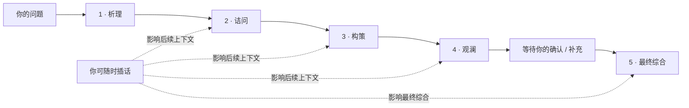
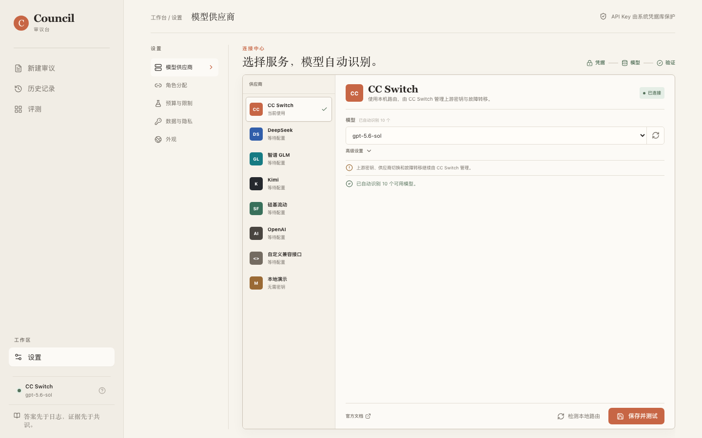

<p align="center">
  
</p>

<h1 align="center">Council Lab · 审议台</h1>

<p align="center">
  让模型席位依次发言、公开回应并形成一个最终答案；短定义和确定性计算自动精简调用。
</p>

<p align="center">
  <a href="https://github.com/loveramarois-byte/council-lab/releases/latest"></a>
  <a href="https://github.com/loveramarois-byte/council-lab/actions/workflows/ci.yml"></a>
  <a href="LICENSE"></a>
  
</p>

<p align="center"><a href="README.en.md">English</a> · <a href="#下载使用">下载</a> · <a href="#工作方式">工作方式</a> · <a href="#provider-支持">Provider</a> · <a href="CONTRIBUTING.md">参与贡献</a> · <a href="https://linux.do/">LINUX DO</a></p>


## Council 是什么

Council 是一个本地优先、允许用户参与的 AI 审议工具。决策、风险和复杂任务可选择连续审议，或让四个席位先进行互不读取的独立初答：

1. **析理**先拆解目标、条件与判断标准。
2. **诘问**明确认同、部分认同或反驳第一席，并寻找反例。
3. **构策**阅读前文，补足约束并形成可执行方案。
4. **观澜**检查分歧、风险和遗漏。
5. 第四席结束后等待你确认或继续补充，再由总结席执行第五次调用，生成**圆桌最终答案**。

快速档会保守识别短定义和确定性算术，改走 **1 个讨论席 + 1 个总结席** 的两次调用路线。决策、风险、预测、模糊数量和高风险领域不会被精简；页面会显示本次实际席位、预计调用和真实 Token。

讨论过程实时可见。你可以在中途补充事实、反驳观点或改变讨论方向，后续席位会读取这些公开内容。

> Council 展示的是模型主动输出的观点、反例、分歧和结论，不展示或保存模型的隐藏思维链。

## 核心功能

- **可见的连续讨论**：不是四份并行答案，后一个席位必须回应前文。
- **可选的独立初答**：每席先只看冻结问题与共同资料，独立轮插话保留给最终总结，避免污染尚未执行的席位。
- **短任务精简路线**：快速档的短定义和确定性算术只调用一个讨论席与总结席，复杂任务仍保留完整四席。
- **全程可参与**：讨论中随时插话，用户输入会进入后续公开上下文。
- **最终确认点**：讨论席完成后默认等待你确认；你也可在创建时明确开启自动总结。高风险模式禁止自动总结。
- **高风险决策门禁**：可在创建时启用医疗、法律、投资、合规和生产事故模式；关键事实缺失会阻断，报告必须由不同的已配置复核者批准，审批不可跨 Run 重放或重复消费。
- **五席独立配置**：四个讨论席和总结席均可分别选择 Provider 与模型，创建审议时固化配置快照。
- **可恢复运行**：启动时检查未完成任务；有效 checkpoint 可续跑，缺少 checkpoint 或凭据会明确标记为可恢复失败。
- **可恢复升级**：SQLite 使用显式 schema 版本；已有数据库升级前自动生成一致性备份，迁移失败会恢复原库，诊断页显示当前版本与备份数量。
- **防重复计费操作**：创建、重跑、推进、插话、重试、续跑、取消和总结支持持久幂等键；网络失败重试不会重复启动同一次模型任务。
- **可重放实时事件**：SSE 事件持久化并带单调序号；断线、刷新或手机切回前台后会先刷新状态再续接，不重复模型调用，多标签页互不争抢事件。
- **受控上下文**：按 Token 预算确定性保留原问题、早期关键摘录、最近发言和最新用户插话。
- **三档工作流模式**：引导 / 圆桌 / 深挖控制上下文预算；仅支持 Responses reasoning 的 Provider 会收到原生 effort 参数。
- **真实运行边界**：默认最多 8 次模型请求、40k Provider 累计 Token，每个席位最长等待 120 秒；等待你确认时不会计时，失败请求仍计入调用限额。
- **限额后可续跑**：达到调用或 Token 边界时保留全部进度，可提高额度后从未完成席位继续，不重复已有发言。
- **多 Provider**：CC Switch、DeepSeek、智谱 GLM、Kimi、硅基流动、OpenAI、自定义兼容接口和 Mock。
- **模型自动识别**：连接后自动拉取模型；CC Switch 空目录时可只读识别近期成功模型。
- **清晰的首次配置**：首次打开会明确区分本地演示与真实 AI，并依次引导连接 Provider、配置五个席位，再开始正式审议。
- **决策回访**：答案生成后记录最终选择、预期结果、复盘日期、实际结果，以及四席观点后来得到支持还是被结果反驳。
- **可移交报告**：审议完成后导出 Markdown 或单文件 HTML，保留问题、逐席发言、模型记录、用量和结果回访。
- **本地优先与密钥保护**：数据默认留在本机，API Key 交给系统凭据库保存。
- **软件内安全更新**：启动时自动检查正式 Release，可在设置中下载、核对 SHA-256、替换并重启；历史和密钥不随应用目录覆盖。
- **脱敏诊断包**：遇到故障时可从“设置 → 诊断与支持”手工导出运行、存储与 Provider 就绪摘要；不自动上传，也不包含对话、日志正文、凭据或本机路径。
- **手机远程审议**：电脑保持运行时，在“设置 → 手机连接”扫码配对；短期签名会话不保存原始令牌，电脑端可查看并立即撤销所有手机会话。
- **可重复评测**：内置 12 个决策、事实核查、风险和规划案例，对直接回答、加强直接回答、自我修正、同模型连续审议、同模型独立初答和跨模型 Council 默认重复 3 次并打乱顺序，记录失败率、Token、耗时、95% 区间、可选成本估算、引用支持率和未经支持主张；Mock 或不完整盲评不能形成效果结论。
- **单页工作台**：桌面与移动端均固定一屏，讨论区内部滚动。

Council 当前不执行联网搜索或代码沙箱，也不提供百分比事实置信度。最终答案是模型对公开讨论的综合，**不等于外部事实核验**。

### 高风险模式

首页的“高风险决策支持”开关必须在创建 Run 时启用。服务端会先建立独立控制记录，再允许模型任务开始；运行期间可填写领域关键事实、提交非约束性报告、请求人工审批，并在审计记录中查看允许或拒绝的状态变化。缺失任何 critical 事实时，报告和审批入口保持阻断。

P0 复核者由启动 Council 的操作者通过环境变量配置，例如 `COUNCIL_HIGH_RISK_REVIEWERS=reviewer-a:long-random-secret,reviewer-b:another-secret`。复核者 ID 与密钥必须各自独立，密钥至少 8 个字符并应使用足够长的随机值。请求者不能审批自己的请求；手机扫码配对只授予 Council 界面访问，不会自动获得复核者权限。复核密钥只保存在当前表单内存和服务端环境中，不应通过聊天、截图或导出报告传递。

该模式只形成待人工负责的决策支持记录，**不会执行交易、提交法律文件、修改药物、运行生产命令或产生其他外部副作用**。它没有联网证据核验、专业身份系统或监管认证，不能替代医生、律师、持牌投资专业人员、合规负责人或生产事故指挥者。

## 下载使用

### 普通用户（macOS）

1. 打开 [最新版本下载页](https://github.com/loveramarois-byte/council-lab/releases/latest)。
2. 下载 `Council-v*-macOS.zip` 并解压。
3. 双击 **`Council.app`**。

Release 包已经内置运行环境，不需要安装 Python 或 Node.js。当前开源构建未做 Apple notarization；首次被 macOS 阻止时，按住 Control 点击 `Council.app`，选择“打开”。

### 普通用户（Windows 10 / 11）

1. 打开 [最新版本下载页](https://github.com/loveramarois-byte/council-lab/releases/latest)。
2. 下载 `Council-v*-Windows.zip`，右键选择“全部解压缩”。
3. 双击 **`Start Council.cmd`**。

Release 包已经内置运行环境，不需要管理员权限，也不需要安装 Python 或 Node.js。当前开源构建没有商业代码签名；如果 Windows 弹出 SmartScreen，请确认文件来自本仓库 Release，再点“更多信息”→“仍要运行”。`Create Desktop Shortcut.cmd` 可选创建桌面快捷方式。

每个正式 Release 同时提供 `SHA256SUMS.txt` 和 GitHub build provenance attestation。前者用于核对下载内容，后者用于关联构建 workflow 与 commit；两者都不等于 Apple notarization 或 Windows 商业代码签名。

### 手机端

1. 在电脑上启动 Council，保持应用运行。
2. 打开 **设置 → 手机连接**。
3. 确认电脑和手机连接同一个可信 Wi-Fi，再用手机扫描页面中的配对码。
4. iPhone 可在 Safari 的分享菜单选择“添加到主屏幕”；Android 可在 Chrome 菜单选择“添加到主屏幕”或“安装应用”。

手机端是电脑端 Council 的远程界面：请求由电脑转发给模型，API Key、CC Switch 和审议数据不迁移到手机。启动时电脑引导令牌与手机配对令牌相互独立，手机令牌不能取得电脑端会话管理权限。手机获得最长 12 小时的签名会话，原始配对令牌不会写入 Cookie；电脑端可查看活动会话数量和最近访问时间，并随时撤销全部手机会话。每次重启 Council 都会轮换令牌，旧配对自动失效。电脑关机、休眠或退出 Council 后，手机端无法继续使用。

已配对手机可以操作普通 Council 界面，但配对会话不是高风险复核身份。高风险批准仍必须提供服务端预先配置的独立复核者 ID 与密钥。

局域网模式使用普通 HTTP，只应在家庭、办公室等可信私有网络中使用，不要在开放公共 Wi-Fi 上开放手机连接。配对接口会限制连续失败，拒绝非同源、异常 Host、非 JSON 和超大请求；普通 HTTP 仍无法阻止同网段被动监听。若手机无法访问二维码地址，请确认系统防火墙允许 Council 或 Node.js 接收端口 `3000` 的局域网连接。完整边界见 [手机访问威胁模型](docs/THREAT_MODEL.md)。

### 后续更新

从 `v0.4.0` 开始，Council 启动时会自动检查正式 Release；发现新版本后进入 **设置 → 软件更新**，点击“下载并安装”。下载、SHA-256 校验、替换和重启均在本机完成。macOS 应用位于需要系统权限的位置时会弹出一次授权窗口，Windows 会原地更新当前完整解压目录，桌面快捷方式无需重建。

`v0.3.0` 及更早版本本身没有更新器，因此需要按上面的步骤手动下载并启动 `v0.4.0` 一次。此后即可使用软件内更新。

### 第一次使用

1. 先用首页的 **本地演示** 提一个问题，确认审议流程正常；它不联网也不产生费用。
2. 使用真实模型时进入 **设置 → 模型供应商**，选择 DeepSeek、智谱、Kimi、硅基流动、OpenAI 或自定义接口。
3. 点击“获取 API Key”进入官方页面，粘贴 Key，再点 **保存并测试**。Council 会先保存到系统凭据库、读取账号真实模型列表、选择模型并执行最小连接测试。

模型目录读取失败时，页面会给出 Key、权限、余额、网络或地址检查提示。少数内置 Provider 会显示明确标注的“离线备选”，它们只是便于排错的参考，不代表账号实时可用；实际列表始终以 Provider `/models` 返回为准。

### 开发者

```bash
git clone https://github.com/loveramarois-byte/council-lab.git
cd council-lab
./setup.sh
./start.sh
```

浏览器会打开 <http://localhost:3000>。默认 Mock Provider 不联网、不需要密钥，也不会产生模型费用。安装问题见 [安装与排错](docs/INSTALL.md)。

> Linux 可通过命令行运行源码。macOS 和 Windows 均已提供可双击的安装与启动入口。详见 [docs/INSTALL.md](docs/INSTALL.md)。

## 工作方式



每个启用的席位都是一次独立 API 调用和独立角色提示。在“设置 → 席位与模型”中可分别配置四席和总结席；创建 Run 时会复制配置快照，后续修改设置不会篡改历史记录。快速档的短定义与确定性算术只启用第一讨论席和总结席；其余任务保持完整 4+1。多个席位也可以主动选择同一 Provider 和基础模型，因此“独立调用”不等于来自不同厂商；一致意见也不等于事实已经验证。

## Provider 支持

| Provider | 配置方式 | 模型发现 | 说明 |
| --- | --- | --- | --- |
| CC Switch | 本机路由，无需在 Council 重填密钥 | 自动 | 上游切换与故障转移由 CC Switch 管理 |
| DeepSeek | API Key | 实时目录 + 离线备选 | 官方兼容接口 |
| 智谱 GLM | API Key | 实时目录 + 离线备选 | 官方 OpenAI-compatible 接口 |
| Kimi | API Key | 实时目录 + 离线备选 | 月之暗面官方接口 |
| 硅基流动 | API Key | 自动 | 一个密钥访问多种开源模型 |
| OpenAI | API Key | 实时目录 + 离线备选 | Responses / Chat Completions |
| 自定义兼容接口 | 地址 + 可选 API Key | 自动或手填 | 适合中转站和自托管服务 |
| 本地演示 | 无需配置 | 固定 Mock | 用于体验和测试，不联网 |



使用真实 Provider 会把问题和公开讨论上下文发送给对应服务，并可能产生费用。连接测试也会执行一次最小生成请求。

Quick / Standard / Rigorous 是 Council 的工作流档位，不自动等同于上游模型的 Low / High / Ultra。设置页会明确显示“原生推理档位”或“仅工作流档位”；只有前者会发送 reasoning effort。

圆桌页分开显示两种 Token：`上下文`是本席发送的公开讨论窗口，已知 OpenAI-compatible 模型使用匹配 tokenizer 并标记“精确”，未知模型使用带安全余量的保守估算并标记“估算”；`上游累计`是 Provider 返回的全程真实 usage。CC Switch 的 Codex 路径可能为每次请求附加约 4k-5k 基础 instructions，因此后者通常明显更高。累计值达到边界后，Council 不再发起下一次请求；由于发出请求前无法预知其最终 usage，最后一次已允许的请求可能让累计值略微超过边界。

## 数据与安全

- API Key 不进入 Council SQLite、日志或前端存储；桌面录入后写入 macOS Keychain、Windows Credential Locker 或 Linux Secret Service。
- 浏览器只访问 Next.js 同源代理；FastAPI 除健康检查外的全部 API 都要求启动器生成的服务端内部令牌，并拒绝恶意 Origin、跨站 Fetch Metadata 和异常 Host。CORS 不作为 CSRF 防线。
- 审议记录默认位于 `~/Library/Application Support/Council/data/`（macOS）或 `%LOCALAPPDATA%\Council\data\`（Windows）。
- 已有业务库发生 schema 升级时会先在数据目录的 `backups/` 保存最近 5 份迁移前备份；这不是用户内容的完整长期备份策略。
- v0.9.0 将业务 schema 升级到 v5，并新增高风险状态、审批和追加式审计表；降级到旧版本前必须恢复自动生成的迁移前备份，旧程序不会理解 v5 数据。
- 旧资料空间只保留历史读取能力。项目、来源、上传和网页抓取写接口默认返回 `410`；仅迁移排障时可临时设置 `COUNCIL_ENABLE_LEGACY_WORKSPACE=1`，不应长期启用。
- 启动日志默认位于 `~/Library/Logs/Council/`（macOS）或 `%LOCALAPPDATA%\Council\logs\`（Windows）。
- CC Switch 模型目录为空时，Council 只读查询近期成功调用过的模型名，不读取其 Provider 配置或密钥，也不修改 CC Switch 数据库。
- 后端默认只监听 loopback。不要把本地凭据接口直接暴露到不可信网络。

完整说明见 [Security Policy](SECURITY.md) 与 [CC Switch 集成边界](docs/CCSWITCH_INTEGRATION.md)。

故障排查时优先使用 [脱敏诊断包](docs/DIAGNOSTICS.md)，发送前仍应自行检查归档内容。

## 技术栈

- **Backend**：Python 3.12、FastAPI、LangGraph、SQLite
- **Frontend**：Next.js 16、React 19、TypeScript、TanStack Query
- **Desktop**：macOS AppleScript `.app` 与 Windows PowerShell / `.cmd` 双击启动器
- **Quality**：Pytest、Playwright、GitHub Actions、Dependabot

## 项目结构

```text
backend/       FastAPI、审议状态机、Provider、上下文与持久化
frontend/      单页圆桌、历史、评测和设置界面
desktop/       macOS / Windows 安装、启动和停止脚本
docs/          架构、设计决策、评测与集成说明
.github/       CI、Release、Issue 和依赖更新配置
```

## 项目状态

当前版本为 `0.12.0`，适合个人研究、方案讨论和非约束性多视角决策辅助。高风险模式提供门禁与审计，不代表事实已核验、专业人员已参与或任何监管合规；请勿将输出直接用于医疗、法律、金融、合规或安全关键执行。

欢迎提交 Issue 和 Pull Request。开始前请阅读 [贡献指南](CONTRIBUTING.md)、[行为规范](CODE_OF_CONDUCT.md) 和 [安全政策](SECURITY.md)。

## 社区认可

Council Lab 认可并感谢 [LINUX DO](https://linux.do/) 社区及佬友们对开源交流、软件开发和项目成长提供的支持。

## License

Copyright 2026 Council Lab contributors. Licensed under the [Apache License 2.0](LICENSE)。Council Lab 与 CC Switch 项目没有官方隶属、授权或背书关系。
