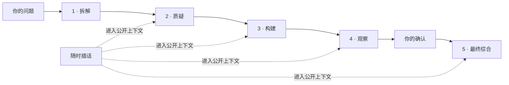

<p align="center">
  
</p>

<h1 align="center">Council Lab</h1>

<p align="center"><strong>让一个复杂问题，经过多席公开审议，变成一份可检查的决策记录。</strong></p>

<p align="center">
  四个讨论席负责拆解、质疑、构建和观察；一个总结席收束共识、分歧、风险与停止条件。<br>
  你可以随时插话，也可以在最终答案形成前补充事实。
</p>

<p align="center">
  <a href="https://github.com/loveramarois-byte/council-lab/releases/latest"></a>
  <a href="https://github.com/loveramarois-byte/council-lab/actions/workflows/ci.yml"></a>
  <a href="LICENSE"></a>
  
</p>

<p align="center"><a href="README.en.md">English</a> · <a href="#下载">下载</a> · <a href="docs/INSTALL.md">安装说明</a> · <a href="SECURITY.md">安全边界</a> · <a href="CONTRIBUTING.md">参与贡献</a></p>


## 复杂问题，不该只剩一段结论

单次聊天很容易给出流畅、肯定、却无法追溯的答案。Council Lab 保留的是一条公开决策路径：谁提出了什么理由，谁反对，哪些事实还没验证，什么情况下应该停止，以及最后为什么得到这个结论。

它适合产品取舍、技术架构、研究规划、风险复核和其他需要多角度审视的问题。它不会展示或保存模型的隐藏思维链，只保留公开回答和运行记录。

| 普通单次聊天 | Council Lab |
| --- | --- |
| 一次生成一个答案 | 多席依次提出观点、反例和替代方案 |
| 假设和分歧藏在长文里 | 分歧、限制、未决问题和少数意见单独保留 |
| 模型决定何时结束 | 默认在总结前等待你的确认 |
| 结果留在聊天历史 | DecisionBrief 保存理由、行动、停止与重开条件 |

## 三步开始

1. 从 [GitHub Releases](https://github.com/loveramarois-byte/council-lab/releases/latest) 下载桌面版，先用 **本地演示** 跑完一次流程；它离线、免费、不需要 Key。
2. 打开 **设置 → 模型供应商**，连接真实 Provider，再把模型分配给四个讨论席和总结席。
3. 提交问题。讨论进行时可以插话；四席结束后确认或补充事实，再生成最终综合。

## 一次审议如何进行



**连续审议**让后续席位阅读并回应前文。**独立初答**先冻结问题与资料，让四席互不读取彼此答案，再公开比较。两种方式都支持确认、恢复、幂等提交和报告导出。

简单定义或确定性计算可以缩短为一个讨论席加总结席；决策、预测、风险和模糊问题保留完整流程。页面会显示本次实际使用的席位、模型、Provider 和用量。

## 为检查而设计

| 能力 | 实际含义 |
| --- | --- |
| 公开多席讨论 | 固定角色分工，回答、反驳和用户插话全部可见 |
| 人工确认 | 默认不会在四席结束后擅自替你收尾；高风险运行不能自动总结 |
| 可恢复运行 | SQLite 与 LangGraph 检查点保留已完成步骤，重启或断线后可继续 |
| 结构化简报 | 保存题目相关理由、支持度、未决问题、行动、停止条件和少数意见 |
| 证据边界 | 区分用户资料、模型推断和未验证主张；模型共识不会冒充事实核验 |
| 本地优先 | 凭据进入操作系统安全存储，审议记录默认留在当前电脑 |
| 手机配对 | 手机只是受控远程界面，Provider 请求、Key 和数据库仍在电脑端 |
| 多 Provider | 支持 CC Switch、DeepSeek、智谱 GLM、Kimi、SiliconFlow、OpenAI 和兼容端点 |

## 真实 API 验收

2026-08-05 使用仓库内置的固定验收集完成 10 个完整 Council Run，共 50 次逻辑模型请求：

| 配置 | 结果 |
| --- | --- |
| CC Switch + `gpt-5.6-sol`，四个讨论席与一个总结席 | 50 / 50 请求成功 |
| 失败 / 重试 / 降级 | 0 / 0 / 0 |
| Provider 请求延迟 | P50 9.487 秒 · P95 44.846 秒 · 最大 81.653 秒 |

公开的脱敏统计保存在 [`evals/results/live-acceptance-50-summary-2026-08-05.json`](evals/results/live-acceptance-50-summary-2026-08-05.json)。这只是单一模型、单一路由和 10 个固定案例的发布验收，不代表所有 Provider 的稳定性，也不构成模型质量排名。

## 下载

### macOS

1. 下载最新版 `Council-v*-macOS.zip`。
2. 解压后双击 **`Council.app`**。

安装包自带运行环境，不要求另装 Python 或 Node.js。当前开源构建尚未经过 Apple 公证；如果首次启动被拦截，请按住 Control 点击 App，选择 **打开** 并确认。

### Windows 10 / 11

1. 下载最新版 `Council-v*-Windows.zip` 并选择 **全部解压**。
2. 双击 **`Start Council.cmd`**；需要时再运行 **`Create Desktop Shortcut.cmd`**。

Windows 包同样自带运行环境，不需要管理员权限。当前开源构建未购买商业代码签名；如 SmartScreen 提示，请先确认文件来自正式 Release，再选择 **更多信息 → 仍要运行**。

正式 Release 会同时提供 `SHA256SUMS.txt` 和 GitHub 构建来源证明。校验和用于确认文件内容，来源证明用于关联工作流与提交；两者都不能替代平台签名。

### 手机访问与更新

电脑端保持 Council 运行，在 **设置 → 手机访问** 扫码配对。手机不会保存 Provider Key 或第二份数据库；会话最长 12 小时，可在电脑端撤销，Council 重启后自动失效。局域网连接使用普通 HTTP，不要在开放公共 Wi-Fi 使用。

桌面版可在 **设置 → 软件更新** 下载、校验并替换安装包，本地历史和凭据不会被覆盖。

## Provider 与数据边界

真实 Provider 会收到你的问题和所选公开上下文，并可能产生费用。`Quick / Standard / Rigorous` 是 Council 的工作流档位，不自动等于上游模型的 Low / High / Ultra；只有明确支持的 Responses Provider 才会收到原生 reasoning effort。

- API Key 不写入 Council SQLite、日志或浏览器存储；桌面端使用 macOS Keychain、Windows Credential Manager 或 Linux Secret Service。
- 浏览器只访问 Next.js 同源代理；FastAPI 除健康检查外都要求启动器生成的内部令牌。
- 审议记录默认位于 macOS 的 `~/Library/Application Support/Council/data/`、Windows 的 `%LOCALAPPDATA%\\Council\\data\\`，或 Linux 的 `${XDG_DATA_HOME:-~/.local/share}/council/data/`。
- Schema 升级前会创建一致性备份，迁移失败则恢复；这不是异机备份。
- CC Switch 集成只读取可观察的本地路由状态，不读取或修改 CC Switch 凭据。

请同时阅读 [SECURITY.md](SECURITY.md)、[威胁模型](docs/THREAT_MODEL.md)、[脱敏诊断说明](docs/DIAGNOSTICS.md) 和 [CC Switch 集成边界](docs/CCSWITCH_INTEGRATION.md)。

## 开发

源码开发需要 Python 3.12+ 和 Node.js 22+：

```bash
git clone https://github.com/loveramarois-byte/council-lab.git
cd council-lab
./setup.sh
./start.sh
```

Council 会打开 <http://localhost:3000>。Linux 通过源码方式支持，安装和排错见 [docs/INSTALL.md](docs/INSTALL.md)。

```text
backend/       FastAPI、审议状态机、Provider、上下文与持久化
frontend/      Next.js、React、TypeScript 工作台
macos/         SwiftUI 与 WKWebView 原生 macOS 外壳
desktop/       桌面安装、启动、停止与兼容脚本
docs/          架构、评测、安全和集成说明
```

## 项目边界

当前版本为 `0.16.0`，适合个人研究、方案讨论和非约束性多视角决策辅助。Council 不执行外部网页搜索或代码沙箱核验；高风险模式可以记录证据、复核和责任声明，但不验证执照真伪，也不构成医疗器械、法律服务、投资顾问或合规认证。不要把模型输出直接用于高风险执行。

Council Lab 感谢 [LINUX DO](https://linux.do/) 社区对开源交流和项目成长的支持。

Copyright 2026 Council Lab contributors. 以 [Apache License 2.0](LICENSE) 开源。Council Lab 与 CC Switch 项目没有官方隶属、授权或背书关系。
