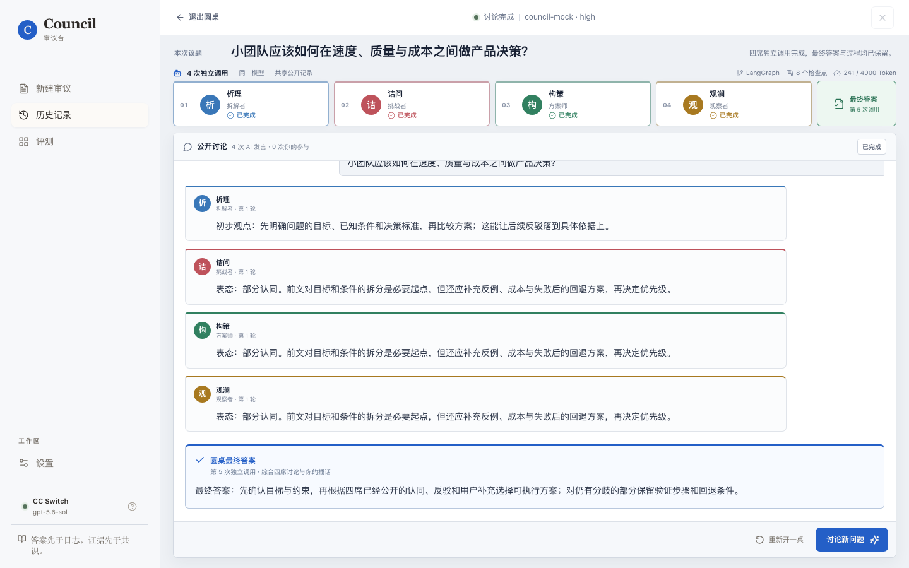
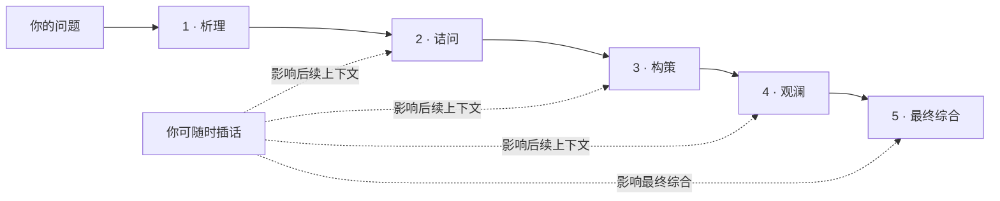

<p align="center">
  
</p>

<h1 align="center">Council Lab · 审议台</h1>

<p align="center">
  让四位 AI 依次发言、公开反驳并形成一个最终答案，而不是同时给你四份互不相干的回复。
</p>

<p align="center">
  <a href="https://github.com/loveramarois-byte/council-lab/releases/latest"></a>
  <a href="https://github.com/loveramarois-byte/council-lab/actions/workflows/ci.yml"></a>
  <a href="LICENSE"></a>
  
</p>

<p align="center"><a href="README.en.md">English</a> · <a href="#下载使用">下载</a> · <a href="#工作方式">工作方式</a> · <a href="#provider-支持">Provider</a> · <a href="CONTRIBUTING.md">参与贡献</a></p>



## Council 是什么

Council 是一个本地优先的多 AI 审议工具。你提出问题后，四个席位按顺序进行独立模型调用：

1. **析理**先拆解目标、条件与判断标准。
2. **诘问**明确认同、部分认同或反驳第一席，并寻找反例。
3. **构策**阅读前文，补足约束并形成可执行方案。
4. **观澜**检查分歧、风险和遗漏。
5. 第五次独立调用综合公开讨论，生成**圆桌最终答案**。

讨论过程实时可见。你可以在中途补充事实、反驳观点或改变讨论方向，后续席位会读取这些公开内容。

> Council 展示的是模型主动输出的观点、反例、分歧和结论，不展示或保存模型的隐藏思维链。

## 核心功能

- **可见的连续讨论**：不是四份并行答案，后一个席位必须回应前文。
- **全程可参与**：讨论中随时插话，用户输入会进入后续公开上下文。
- **可靠恢复**：LangGraph 状态机、SQLite 持久化与 checkpoint 支持失败后从当前席位继续。
- **受控上下文**：Token 预算、滚动摘要和最近发言优先，避免会话无限膨胀。
- **三档推理强度**：Quick / Standard / Rigorous 对应 Low / High / Ultra。
- **多 Provider**：CC Switch、DeepSeek、智谱 GLM、Kimi、硅基流动、OpenAI、自定义兼容接口和 Mock。
- **模型自动识别**：连接后自动拉取模型；CC Switch 空目录时可只读识别近期成功模型。
- **本地优先与密钥保护**：数据默认留在本机，API Key 交给系统凭据库保存。
- **单页工作台**：桌面与移动端均固定一屏，讨论区内部滚动。

## 下载使用

### 普通用户（macOS）

首次使用需要安装 [Python 3.12+](https://www.python.org/downloads/) 和 [Node.js 22+](https://nodejs.org/)。两者都使用官方网站的默认安装方式即可。

1. 打开 [最新版本下载页](https://github.com/loveramarois-byte/council-lab/releases/latest)。
2. 下载 `Council-v*-macOS.zip` 并解压。
3. 双击文件夹里的 **`安装 Council.command`**。
4. 安装完成后，双击桌面的 **`Council.app`**。

首次被 macOS 阻止时，按住 Control 点击安装器，选择“打开”。安装器只在当前项目内安装依赖并创建桌面启动入口，不会删除已有审议记录。

### 开发者

```bash
git clone https://github.com/loveramarois-byte/council-lab.git
cd council-lab
./setup.sh
./start.sh
```

浏览器会打开 <http://localhost:3000>。默认 Mock Provider 不联网、不需要密钥，也不会产生模型费用。安装问题见 [安装与排错](docs/INSTALL.md)。

> Linux 和 Windows 当前可运行源码，但暂未提供桌面安装包。详见 [docs/INSTALL.md](docs/INSTALL.md)。

## 工作方式



每个席位都是一次独立 API 调用和独立角色提示。多个席位可以使用同一 Provider 和基础模型，因此“独立”不等于来自不同厂商；一致意见也不等于事实已经验证。

## Provider 支持

| Provider | 配置方式 | 模型发现 | 说明 |
| --- | --- | --- | --- |
| CC Switch | 本机路由，无需在 Council 重填密钥 | 自动 | 上游切换与故障转移由 CC Switch 管理 |
| DeepSeek | API Key | 自动 + 推荐列表 | 官方兼容接口 |
| 智谱 GLM | API Key | 自动 + 推荐列表 | 官方 OpenAI-compatible 接口 |
| Kimi | API Key | 自动 + 推荐列表 | 月之暗面官方接口 |
| 硅基流动 | API Key | 自动 | 一个密钥访问多种开源模型 |
| OpenAI | API Key | 自动 + 推荐列表 | Responses / Chat Completions |
| 自定义兼容接口 | 地址 + 可选 API Key | 自动或手填 | 适合中转站和自托管服务 |
| 本地演示 | 无需配置 | 固定 Mock | 用于体验和测试，不联网 |


使用真实 Provider 会把问题和公开讨论上下文发送给对应服务，并可能产生费用。连接测试也会执行一次最小生成请求。

## 数据与安全

- API Key 不进入 Council SQLite、日志或前端存储；桌面录入后写入 macOS Keychain、Windows Credential Locker 或 Linux Secret Service。
- 审议记录默认位于 `~/Library/Application Support/Council/data/`（macOS）。
- 启动日志默认位于 `~/Library/Logs/Council/`。
- CC Switch 模型目录为空时，Council 只读查询近期成功调用过的模型名，不读取其 Provider 配置或密钥，也不修改 CC Switch 数据库。
- 后端默认只监听 loopback。不要把本地凭据接口直接暴露到不可信网络。

完整说明见 [Security Policy](SECURITY.md) 与 [CC Switch 集成边界](docs/CCSWITCH_INTEGRATION.md)。

## 技术栈

- **Backend**：Python 3.12、FastAPI、LangGraph、SQLite
- **Frontend**：Next.js 16、React 19、TypeScript、TanStack Query
- **Desktop**：AppleScript `.app` 启动器与 shell 安装脚本
- **Quality**：Pytest、Playwright、GitHub Actions、Dependabot

## 项目结构

```text
backend/       FastAPI、审议状态机、Provider、上下文与持久化
frontend/      单页圆桌、历史、评测和设置界面
desktop/       macOS 安装、启动和停止脚本
docs/          架构、设计决策、评测与集成说明
.github/       CI、Release、Issue 和依赖更新配置
```

## 项目状态

当前版本为 `0.1.0`，适合个人研究、方案讨论和多视角决策辅助。请勿将未经人工复核的输出直接用于医疗、法律、金融或安全关键决策。

欢迎提交 Issue 和 Pull Request。开始前请阅读 [贡献指南](CONTRIBUTING.md)、[行为规范](CODE_OF_CONDUCT.md) 和 [安全政策](SECURITY.md)。

## License

Copyright 2026 Council Lab contributors. Licensed under the [Apache License 2.0](LICENSE)。Council Lab 与 CC Switch 项目没有官方隶属、授权或背书关系。
