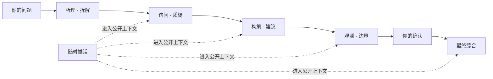

<p align="center">
  
</p>

<h1 align="center">Council</h1>

<p align="center"><strong>复杂问题，不该只有一个声音。</strong></p>

<p align="center">
  四个立场不同的席位公开分析、相互质疑。<br>
  你确认边界之后，Council 再交付一份可回看、可执行的决策简报。
</p>

<p align="center">
  <a href="https://github.com/loveramarois-byte/council-lab/releases/download/v0.18.4/Council-v0.18.4-macOS.zip"><strong>下载 macOS 版</strong></a>
  &nbsp;&nbsp;·&nbsp;&nbsp;
  <a href="https://github.com/loveramarois-byte/council-lab/releases/download/v0.18.4/Council-v0.18.4-Windows.zip"><strong>下载 Windows 版</strong></a>
</p>

<p align="center"><sub>免费开源 · 本地优先 · 可以先用本地演示，无需 API Key</sub></p>

<p align="center"><a href="README.en.md">English</a> · <a href="#三步开始">三步开始</a> · <a href="docs/INSTALL.md">安装说明</a> · <a href="SECURITY.md">安全边界</a></p>


## 30 秒看懂 Council

> **提出真实问题 → 四席拆解与质疑 → 你随时补充事实 → 确认后形成 `DecisionBrief`**

Council 不是把四份回答堆在一起。后续席位可以回应前文，也可以使用“独立初答”先隔离观点再公开比较；分歧、未决问题和少数意见不会在最终总结里被悄悄抹平。

| 普通聊天 | Council |
| --- | --- |
| 一个模型直接生成答案 | 析理、诘问、构策、观澜依次审议 |
| 假设和分歧埋在长文里 | 反例、边界、未决问题单独保留 |
| 模型自行决定何时结束 | 最终综合前默认等待你的确认 |
| 结果停留在聊天记录 | 保存理由、行动、停止条件与重开条件 |

Council 不展示或保存模型的隐藏思维链。你看到的是可检查的公开发言、自己的插话，以及结构化结果。

## 讨论最终变成行动


每次审议都会留下完整来路，而不只是一段“听起来合理”的结论：

- **公开讨论**：查看不同观点、反例，以及自己的补充如何改变后续判断。
- **人工确认**：最终综合前由你确认；高风险流程禁止自动收尾。
- **结构化简报**：分开保存关键理由、未决问题、行动、停止与重开条件。
- **证据边界**：区分用户资料、模型推断和未核验主张；共识不冒充事实。
- **可恢复运行**：断线、关闭窗口或重启后，从已完成步骤继续，不必从头付费重跑。

## 三步开始

不需要先理解模型、Provider 或工作流。

1. 下载并打开桌面版，选择 **本地演示**。它离线、免费、不需要 API Key。
2. 输入一个正在困扰你的真实问题，看四席如何拆解；需要时直接插话或补充事实。
3. 准备使用真实模型时，再到 **设置 → 模型供应商** 连接 CC Switch、OpenAI 或兼容服务。

拿不准审议深度时，直接使用默认的 **圆桌**。简单定义和确定性计算可以使用 **引导**；复杂策略、重大风险与模糊问题使用 **深挖**。

macOS 与 Windows 安装包都自带 Python、Node.js 和所需依赖。API Key 不会进入 Council 数据库、日志或浏览器存储。

### 不知道问什么？先试这几个

- **产品决策**：我们是否应该在 6 周内上线付费计划？请按用户价值、验证成本、失败条件和停止条件审议。
- **技术方案**：这个数据库迁移方案的主要故障模式是什么？请给出分阶段验证、回滚和上线门槛。
- **信息整理**：把这组资料分成已核验事实、待核验主张、关键缺口和下一步要问专业人士的问题。

## 四席如何协作



**连续审议**让后续席位阅读并回应前文。**独立初答**先冻结问题和资料，让各席互不读取彼此答案，再公开比较。每一步都会显示实际使用的角色、模型、Provider 和用量。

## 专业问题有明确边界

Council 提供一般决策、产品评审、技术架构，以及医疗、法律、财务信息整理模板。模板会改变需要补充的事实、风险提示和输出结构，不会扩大产品权限。

| 场景 | Council 可以做 | Council 不会做 |
| --- | --- | --- |
| 医疗 | 整理症状、时间线、红旗信号和就医问题 | 诊断或决定治疗方案 |
| 法律 | 整理事实、时效、司法辖区和待咨询事项 | 提供法律意见或提交法律文件 |
| 财务 | 整理目标、期限、流动性、费用与风险 | 给出投资建议或执行交易 |
| 技术 | 审查架构、风险、验证与回滚条件 | 未经确认执行生产变更 |

关键事实缺失、证据过期或存在安全异议时，高风险流程会阻止形成可执行结论。专业模式是决策支持，不是专业人士的替代品。Council 不验证执照，也不会开药、交易、提交法律文件或执行生产变更。

## 下载与安装

### macOS

下载 [`Council-v0.18.4-macOS.zip`](https://github.com/loveramarois-byte/council-lab/releases/download/v0.18.4/Council-v0.18.4-macOS.zip)，解压后双击 `Council.app`。当前开源构建尚未经过 Apple 公证；如果首次启动被拦截，请按住 Control 点击 App，选择 **打开** 并确认。

### Windows 10 / 11

下载 [`Council-v0.18.4-Windows.zip`](https://github.com/loveramarois-byte/council-lab/releases/download/v0.18.4/Council-v0.18.4-Windows.zip)，选择 **全部解压**，再双击 `Start Council.cmd`。不需要管理员权限。当前构建没有商业代码签名；如 SmartScreen 提示，请先确认文件来自本仓库 Release，再选择 **更多信息 → 仍要运行**。

正式 Release 同时提供 `SHA256SUMS.txt` 和 GitHub 构建来源证明。桌面版可以在 **设置 → 软件更新** 检查新版本并打开官方 Release；当前公开构建不会在应用内自动执行下载包。手动安装不会覆盖本地历史和凭据。

## 数据与凭据

真实 Provider 会收到你的问题和所选公开上下文，并可能产生费用。`引导 / 圆桌 / 深挖` 是 Council 的工作流档位，不自动等于上游模型的推理强度。

- API Key 不写入 SQLite、日志或浏览器存储；桌面端使用 macOS Keychain、Windows Credential Manager 或 Linux Secret Service。
- 审议记录默认保存在当前电脑。手机只是远程界面；Provider 请求、Key 和数据库仍在电脑端。
- 手机配对最长 12 小时，可以在电脑端撤销，Council 重启后自动失效。局域网访问不要用于开放公共 Wi-Fi。
- Schema 升级前会创建一致性备份，迁移失败则恢复；这不是异机备份。

<details>
<summary>默认保存位置与本地服务边界</summary>

审议记录默认位于 macOS 的 `~/Library/Application Support/Council/data/`、Windows 的 `%LOCALAPPDATA%\\Council\\data\\`，或 Linux 的 `${XDG_DATA_HOME:-~/.local/share}/council/data/`。浏览器只访问 Next.js 同源代理；FastAPI 除健康检查外都要求启动器生成的内部令牌。

</details>

详见 [安全边界](SECURITY.md)、[威胁模型](docs/THREAT_MODEL.md)、[脱敏诊断](docs/DIAGNOSTICS.md) 和 [CC Switch 集成边界](docs/CCSWITCH_INTEGRATION.md)。

## 公开验证

2026-08-05，仓库固定验收集在 `CC Switch + gpt-5.6-sol` 上完成 10 个完整 Run、50 次逻辑模型请求：`50 / 50` 成功，失败、重试、降级均为 `0`。Provider 延迟为 P50 `9.487s`、P95 `44.846s`、最大 `81.653s`。

脱敏统计见 [`live-acceptance-50-summary-2026-08-05.json`](evals/results/live-acceptance-50-summary-2026-08-05.json)。这是单一模型、单一路由和固定案例的发布验收，不代表所有 Provider，也不是模型质量排名。

## 开发

源码开发需要 Python 3.12+ 和 Node.js 22+：

```bash
git clone https://github.com/loveramarois-byte/council-lab.git
cd council-lab
./setup.sh
./start.sh
```

Linux 通过源码方式支持。完整安装和排错见 [docs/INSTALL.md](docs/INSTALL.md)，架构见 [docs/ARCHITECTURE.md](docs/ARCHITECTURE.md)，贡献说明见 [CONTRIBUTING.md](CONTRIBUTING.md)。

## 社区致谢

Council Lab 认可并感谢 [LINUX DO](https://linux.do/) 社区及佬友们对开源交流、软件开发和项目成长提供的支持。

---

Council 当前版本为 `0.18.4`，以 [Apache License 2.0](LICENSE) 开源。Council Lab 与 CC Switch 项目没有官方隶属、授权或背书关系。
